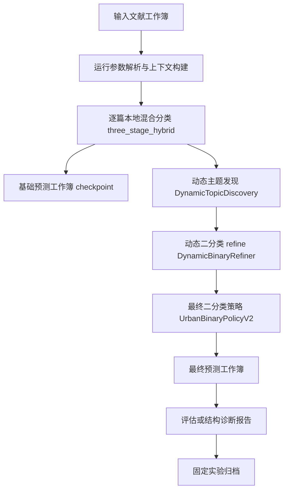

# 城市更新指标提取任务体系化执行文档

## 1. 文档目标与任务边界

本文档描述城市更新指标提取任务从输入文献到最终二分类结果、解释字段、评估报告和实验归档的完整流程。当前稳定策略以 `three_stage_hybrid` 为主线，在 no-LLM 模式下不调用大模型/API；在 research_matrix 且显式打开 `--hybrid-llm-assist on` 时，LLM 只作为困难样本裁决器，不替代规则全量分类。

任务的最终目标是输出稳定、可解释、可复核的城市更新二分类结果：

- `final_label`
- `urban_flag`
- `是否属于城市更新研究`

上述三列必须保持一致。`topic_final`、动态主题和解释字段用于支持二分类、复核和策略迭代，但不应被误读为最终二分类标签本身。

## 2. 总体流程



全流程分为四类产物：

- 预测产物：逐篇文献的标签、主题、解释证据和策略动作。
- 评估产物：有真值数据上的 Accuracy、Precision、Recall、F1、错误分析和策略分析。
- 结构诊断产物：无真值全量数据上的正例率、主题分布、冲突样本、动态主题分布。
- 归档产物：摘要 CSV、复现命令、工件路径索引和实验说明文档。

## 3. 第 0 步：输入数据与运行配置

### 输入

核心输入是 Excel 工作簿，至少需要具备以下字段：

| 字段 | 用途 |
|---|---|
| `Article Title` | 主标题证据，参与规则、主题、动态聚类和 LLM 裁决输入 |
| `Abstract` | 摘要证据，参与主体判断 |
| `Author Keywords` | 作者关键词，用于主题识别和动态主题关键词抽取 |
| `Keywords Plus` | 扩展关键词，用于补充主题证据 |
| `WoS Categories` | 学科背景，用于识别泛城市、方法类、生态、交通等非目标语境 |
| `Research Areas` | 研究领域背景证据 |

全量实验输入：

`Data/Urban Renovation V2.0/input/labels/Urban Renovation V2.0.xlsx`

### 运行参数

no-LLM 全量运行的核心参数如下：

```powershell
.\.venv-bertopic313\Scripts\python.exe scripts\pipeline\main_py313.py `
  --task urban_renewal `
  --experiment-track research_matrix `
  --input "Data\Urban Renovation V2.0\input\labels\Urban Renovation V2.0.xlsx" `
  --dataset-id "Urban Renovation V2.0_policy_v2_full_no_llm_full_on_complete_20260429" `
  --urban-method three_stage_hybrid `
  --hybrid-llm-assist off `
  --dynamic-topics on `
  --dynamic-topics-full-corpus `
  --dynamic-binary-refine on `
  --dynamic-binary-allow-flip `
  --non-interactive `
  --output "Data\Urban Renovation V2.0\runs\research_matrix\20260429_policy_v2_full_no_llm_full_on_complete\predictions\urban_renewal_three_stage_hybrid_policy_v2_full_no_llm_full_on_complete_20260429.xlsx"
```

### 输出

本步骤输出运行上下文，包括：

- `dataset_id`
- `experiment_track`
- `truth_file`
- `session_policy`
- `urban_method`
- `hybrid_llm_assist_enabled`
- `dynamic_topics_enabled`
- `dynamic_topics_include_full_corpus`
- `dynamic_binary_refinement_enabled`
- `dynamic_binary_refinement_allow_flip`

这些上下文决定后续是否启用动态主题、动态二分类 refine、LLM 裁决，以及输出目录结构。

## 4. 第 1 步：读取数据与准备运行表

### 输入

- 输入 Excel 工作簿。
- 运行上下文。
- 可选 `--limit`。

### 分析与处理

`TaskRouter.run_urban_renewal()` 负责读取输入表，创建输出路径，并按行遍历文献。若设置 `order_seed`，会进行可复现重排；若设置 `limit`，只取前 N 行。当前全量运行未设置 `limit`，因此应输出 `40276` 行。

运行期间会按 checkpoint 间隔写入临时预测工作簿。需要注意：checkpoint 不是最终结果，可能只包含部分样本，也可能尚未经过动态主题和 V2 最终策略后处理。判断是否为最终结果必须同时检查：

- 进程已经结束。
- stdout 出现 `Done.`。
- 输出行数等于输入行数。
- 输出字段包含 `binary_policy_action`、`dynamic_topic_id`、`llm_adjudication_required` 等后处理字段。

### 输出

- 中间 checkpoint 工作簿。
- 最终运行时的逐篇基础结果列表 `results_list`。

## 5. 第 2 步：逐篇本地混合分类

### 输入

每篇文献输入以下信息：

- 标题：`Article Title`
- 摘要：`Abstract`
- 关键词：`Author Keywords`、`Keywords Plus`
- 学科背景：`WoS Categories`、`Research Areas`
- 运行审计信息：输入路径、输出路径、样本序号、运行方式等。

### 分析逻辑

`three_stage_hybrid` 的基础分类逻辑可以概括为四层。

第一层是 metadata 和 stage1 规则预筛：

- 识别明显城市更新锚点，如 renewal、regeneration、redevelopment、revitalization、rehabilitation、retrofit、adaptive reuse、gentrification 等。
- 识别既有城市对象，如 built environment、neighborhood、community、brownfield、old district、housing estate、industrial heritage、public space、informal settlement 等。
- 识别风险语境，如 rural regeneration、纯方法模型、交通/生态/旅游背景、泛城市政策但无更新对象等。
- 生成 `stage1_decision`、`stage1_reason_tag`、`stage1_hit_signals`、`stage1_risk_tags`、`stage1_conflict_flag`。

第二层是固定 `topic taxonomy` 判断：

- 根据规则、局部主题分类和主题融合逻辑生成 `topic_rule`、`topic_local_label`、`topic_final`。
- `topic_final_group` 只分为 `urban`、`nonurban`、`unknown`。
- `topic_final_name` 提供主题名称解释。
- `taxonomy_coverage_status` 说明样本是否被固定 taxonomy 覆盖、是否 unknown、是否 open-set 或 binary_resolved。

第三层是二分类打分与证据合成：

- 输出 `urban_probability_score` 和 `binary_decision_threshold`。
- 输出 `binary_decision_source` 和 `binary_decision_evidence`。
- 输出 `evidence_balance`，例如 `strong_positive`、`conflict_positive`、`strong_negative`、`low_confidence_positive`。
- 输出 `decision_explanation`、`primary_positive_evidence`、`primary_negative_evidence`、`decision_rule_stack`。

第四层是 Unknown recovery：

- 对 `topic_final=Unknown` 或 taxonomy 覆盖不足样本进行本地恢复判断。
- 使用更新动作词、城市对象词、固定主题规则和风险阻断规则。
- 输出 `unknown_recovery_path` 和 `unknown_recovery_evidence`。

### 输出

本步骤为每篇文献输出基础预测行，主要字段包括：

| 输出字段 | 含义 |
|---|---|
| `final_label` / `urban_flag` / `是否属于城市更新研究` | 基础二分类结果，后续仍会被 V2 策略统一校准 |
| `topic_final` | 固定 taxonomy 的主题标签 |
| `topic_final_group` | `urban` / `nonurban` / `unknown` |
| `urban_probability_score` | 城市更新概率或规则融合分 |
| `binary_decision_source` | 二分类来源链 |
| `decision_explanation` | 规则解释 |
| `evidence_balance` | 证据倾向 |
| `review_flag_raw` / `review_reason_raw` | 复核触发信号 |
| `unknown_recovery_path` / `unknown_recovery_evidence` | Unknown 恢复路径和证据 |

## 6. 第 3 步：动态主题发现

### 输入

动态主题模块输入基础预测 DataFrame，读取以下字段：

- 文献文本：标题、摘要、关键词、学科背景。
- 主题字段：`topic_final`、`topic_final_group`。
- 复核字段：`review_flag_raw`、`review_reason_raw`。
- 覆盖字段：`taxonomy_coverage_status`。
- 决策来源：`binary_decision_source`、`decision_source`。
- 当前二分类：`final_label`、`urban_flag`、`是否属于城市更新研究`。

### 候选池构建

`DynamicTopicDiscovery` 默认优先处理需要解释或复核的样本：

- `topic_final=Unknown` 或 `topic_final_group=unknown`。
- `taxonomy_coverage_status in {unknown, open_set, binary_resolved}`。
- `review_flag_raw > 0`。
- `review_reason` 包含 unknown、open_set、near_threshold、conflict、inconsistency、uncertain。
- `binary_decision_source` 包含 unknown、review、uncertain、anchor_guard。
- 如果打开 `--dynamic-topics-full-corpus`，非候选样本也进入 `full_corpus_pool`，用于背景聚类。

### 聚类与命名

优先使用本地 sklearn 路径：

- `TfidfVectorizer` 抽取 1-2 gram 文本特征。
- `MiniBatchKMeans` 根据样本规模和 `min_topic_size` 生成动态主题簇。
- 每个簇提取 top keywords。
- 若 sklearn 路径失败，则降级到关键词桶聚类。

动态主题名不调用 LLM，而是使用关键词模板生成。例如：

- brownfield -> 棕地再开发
- neighborhood -> 社区更新
- old_community -> 老旧小区改造
- heritage/historic -> 历史街区或遗产活化
- gentrification -> 绅士化与社区变化

### 固定 taxonomy 映射

动态主题关键词会与 `TOPIC_DEFINITIONS` 的 seed、context_terms、positive_terms、negative_terms 做词项重叠匹配：

- 高于阈值：`dynamic_mapping_status=mapped_to_fixed`。
- 有城市更新动作锚点但不能映射固定主题：`candidate_new_urban_topic`。
- 命中 rural、transport、algorithm、ecology、tourism 等非城市更新倾向词：`candidate_new_nonurban_topic`。
- 证据不足：`needs_review`。

### 输出

| 字段 | 含义 |
|---|---|
| `dynamic_topic_id` | 动态主题编号，例如 `DUR_0001` |
| `dynamic_topic_name_zh` | 规则生成的中文主题名 |
| `dynamic_topic_keywords` | 主题关键词 |
| `dynamic_topic_size` | 主题簇样本量 |
| `dynamic_topic_confidence` | 由样本量、映射分、关键词数综合得到的置信度 |
| `dynamic_topic_source_pool` | 来源池，如 `unknown_pool`、`review_pool`、`full_corpus_pool` |
| `dynamic_to_fixed_topic_candidate` | 建议映射到的固定主题 |
| `dynamic_mapping_status` | 映射状态 |

同时生成动态二分类候选：

| 字段 | 含义 |
|---|---|
| `dynamic_binary_candidate_label` | 动态主题建议的二分类标签 |
| `dynamic_binary_candidate_confidence` | 动态二分类候选置信度 |
| `dynamic_binary_candidate_action` | supports_current_label / possible_false_negative_cluster / possible_false_positive_cluster / needs_review |
| `dynamic_binary_candidate_reason` | 候选判断证据 |
| `dynamic_binary_review_priority` | 复核优先级 |

## 7. 第 4 步：动态二分类 refine

### 输入

动态二分类 refine 输入动态主题结果和基础二分类字段。

关键输入字段：

- `dynamic_binary_candidate_label`
- `dynamic_topic_confidence`
- `dynamic_topic_size`
- `topic_final`
- `taxonomy_coverage_status`
- `review_flag_raw`
- `urban_probability_score`
- `binary_decision_threshold`
- `uncertain_nonurban_guard_action`

### 分析逻辑

`DynamicBinaryRefiner` 是确定性后处理，不调用 LLM/API。其作用是允许高置信动态主题证据补充二分类，但不能让动态主题单独成为最终事实标签。

基本门槛：

- `dynamic_binary_candidate_label` 必须是 `0` 或 `1`。
- `dynamic_topic_confidence >= 0.72`。
- `dynamic_topic_size >= 20`。

样本范围：

- 默认处理 Unknown 或 taxonomy unknown。
- 若打开 `--dynamic-binary-allow-flip`，也允许处理已有二分类与动态主题候选冲突的样本。

正例提升门槛：

- Unknown 样本要有核心城市更新动作锚点，且不能有农村风险。
- 已有负例转正时，要满足复核或近阈值条件，并通过 anchor gate。
- 动态主题不能把已有正例直接翻为负例；这样设计是为了避免大批量漏召。

### 输出

| 字段 | 含义 |
|---|---|
| `dynamic_binary_override_applied` | 是否应用动态 refine |
| `dynamic_binary_override_label` | refine 建议并应用的标签 |
| `dynamic_binary_override_topic` | refine 对应主题 |
| `dynamic_binary_override_reason` | refine 证据链 |
| `dynamic_binary_override_source` | refine 来源，例如 `dynamic_topic_refiner_unknown` |

若 `mutate_final_fields=True`，该步骤会同步更新：

- `final_label`
- `urban_flag`
- `是否属于城市更新研究`
- `topic_final`
- `topic_final_group`
- `topic_final_name`
- `taxonomy_coverage_status`
- `binary_decision_source`
- `decision_explanation`
- `binary_decision_evidence`

## 8. 第 5 步：最终二分类策略 UrbanBinaryPolicyV2

### 输入

`UrbanBinaryPolicyV2` 接收已经过基础分类、动态主题和动态二分类 refine 的 DataFrame。

关键输入字段：

- 当前二分类：`final_label`、`urban_flag`、`是否属于城市更新研究`
- 固定主题：`topic_final`、`topic_final_group`
- 二分类分数：`urban_probability_score`、`binary_decision_threshold`
- 证据倾向：`evidence_balance`
- 风险信号：`metadata_route_reason`、`stage1_risk_tags`
- 动态主题候选：`dynamic_binary_candidate_label`
- 解释字段：`primary_positive_evidence`、`primary_negative_evidence`

### 证据信号抽取

策略会从标题、摘要、关键词和学科背景中抽取：

- 更新动作锚点：renewal、regeneration、redevelopment、revitalization、rehabilitation、retrofit、adaptive reuse、gentrification 等。
- 既有城市对象锚点：built environment、neighborhood、community、settlement、brownfield、old district、housing、public space 等。
- 农村风险：rural、village/agriculture 等与非城市更新相关语境。
- 方法风险：algorithm、model、simulation、generic technical 等纯方法或背景支持语境。
- 泛城市语境：urban、city、municipal、metropolitan 等。

只有“更新动作锚点 + 既有城市对象锚点 + 无农村/纯方法风险”同时成立时，才构成强正例证据。

### 判定规则

第一优先级：hard negative。

- `metadata_route_reason in {math_term_misuse, rural_nonurban}`。
- 或 `binary_decision_source` 包含 `binary_hard_negative_override`。
- 输出 `binary_policy_action=protected_negative`，最终标签为 `0`。

第二优先级：当前非正例的恢复。

- 如果当前不是正例，但存在强正例证据，或 `topic_final_group=urban` 且分数足够、无方法风险，则恢复为正例。
- 否则保持负例或未解析为负例，输出 `accept_negative`。

第三优先级：城市更新主题正例。

- `topic_final_group=urban` 且当前二分类为正，通常输出 `accept_positive`。
- 若存在方法风险且缺少强正例证据，则转入 `conflict_review`。

第四优先级：非城市或 Unknown 主题下的正例冲突。

若当前二分类为正，但出现以下情况，会记录冲突：

- `binary_topic_inconsistency`
- `evidence_balance=conflict_positive`
- `topic_final_group in {nonurban, unknown}`
- `topic_final` 属于高风险非城市主题 `N1/N3/N4/N5/N7/N9/N10`
- 方法或背景语境风险
- 分数接近阈值
- 动态主题候选为负例

如果同时有强城市更新证据且无农村风险，仍可输出 `accept_positive`。否则输出 `conflict_review`，no-LLM 模式下仍为正例但标记需要裁决，LLM 模式下进入困难样本裁决。

### LLM 裁决边界

LLM 只在以下条件同时满足时运行：

- `experiment_track=research_matrix`
- `--hybrid-llm-assist on`
- `urban_method=three_stage_hybrid`
- `UrbanBinaryPolicyV2` 判定 `llm_adjudication_required=1`

LLM 输入包括标题、摘要、关键词、当前规则证据、固定主题、动态主题和冲突类型。输出必须是严格 JSON：

```json
{"label":"0 or 1","confidence":0.0,"reason":"short evidence"}
```

只有当 label 可解析且 `confidence >= 0.75` 时，LLM 才覆盖最终标签并设置 `llm_used=1`。解析失败或低置信只记录 `llm_attempted=1`，不覆盖规则结果。

no-LLM 路径必须保持：

- `llm_used_sum == 0`
- `llm_attempted_sum == 0`

### 输出

| 字段 | 含义 |
|---|---|
| `binary_policy_action` | `accept_positive` / `accept_negative` / `protected_negative` / `conflict_review` |
| `binary_policy_reason` | V2 策略原因 |
| `binary_policy_conflict_type` | 冲突类型组合 |
| `llm_adjudication_required` | 是否需要 LLM 裁决 |
| `llm_adjudication_label` | LLM 裁决标签，仅 LLM 模式可能有值 |
| `llm_adjudication_confidence` | LLM 裁决置信度 |
| `llm_adjudication_reason` | LLM 裁决理由 |

最终强制同步：

- `final_label`
- `urban_flag`
- `是否属于城市更新研究`

## 9. 第 6 步：最终预测工作簿输出

### 输入

经过所有后处理的最终 DataFrame。

### 输出

最终预测工作簿路径示例：

`Data/Urban Renovation V2.0/runs/research_matrix/20260429_policy_v2_full_no_llm_full_on_complete/predictions/urban_renewal_three_stage_hybrid_policy_v2_full_no_llm_full_on_complete_20260429.xlsx`

必须检查以下内容：

| 检查项 | 标准 |
|---|---|
| 行数 | 等于输入行数，当前全量为 `40276` |
| no-LLM 合同 | `llm_used_sum=0` 且 `llm_attempted_sum=0` |
| 标签一致性 | `final_label/urban_flag/是否属于城市更新研究` 不一致数为 0 |
| V2 字段 | 包含 `binary_policy_action`、`binary_policy_reason`、`llm_adjudication_required` |
| 动态字段 | 包含 `dynamic_topic_id`、`dynamic_mapping_status`、`dynamic_binary_candidate_label` |

## 10. 第 7 步：评估与结构诊断

### 有标签样本评估

若有真值标签，使用 `scripts/evaluation/evaluate.py` 生成评估报告。核心分析包括：

- Accuracy、Precision、Recall、F1。
- TP、TN、FP、FN。
- 主题混淆矩阵。
- Unknown Rate。
- Guardrails。
- Urban Error Analysis。
- Dynamic Topic Coverage。
- Dynamic Binary Recommendations。
- `Binary Policy Analysis`。
- `LLM Adjudication Analysis`。

1000 篇有标签样本的目标是：

- no-LLM Accuracy >= 80%。
- LLM 困难样本裁决 Accuracy >= 85%。

### 无标签全量结构诊断

全量库没有人工真值，因此不计算 Accuracy。主要看结构指标：

- 样本总数。
- 正例数、负例数、正例率。
- `binary_policy_action` 分布。
- `topic_final_group` 分布。
- `evidence_balance` 分布。
- `dynamic_mapping_status` 分布。
- `taxonomy_coverage_status` 分布。
- `llm_used_sum` 和 `llm_attempted_sum`。
- 标签一致性。

当前全量 no-LLM 结果：

| 指标 | 数值 |
|---|---:|
| 输出行数 | 40276 |
| 正例数 | 30770 |
| 负例数 | 9506 |
| 正例率 | 76.40% |
| `llm_used_sum` | 0 |
| `llm_attempted_sum` | 0 |
| `llm_adjudication_required_sum` | 16939 |
| 标签一致性错误 | 0 |

策略动作分布：

| `binary_policy_action` | 数量 | 占比 |
|---|---:|---:|
| `conflict_review` | 16939 | 42.06% |
| `accept_positive` | 13831 | 34.34% |
| `accept_negative` | 9322 | 23.15% |
| `protected_negative` | 184 | 0.46% |

主题组分布：

| `topic_final_group` | 数量 | 占比 |
|---|---:|---:|
| `nonurban` | 17706 | 43.96% |
| `urban` | 11945 | 29.66% |
| `unknown` | 10625 | 26.38% |

动态映射分布：

| `dynamic_mapping_status` | 数量 | 占比 |
|---|---:|---:|
| `mapped_to_fixed` | 30254 | 75.12% |
| `needs_review` | 7457 | 18.51% |
| `candidate_new_nonurban_topic` | 2378 | 5.90% |
| `candidate_new_urban_topic` | 187 | 0.46% |

## 11. 第 8 步：实验归档

### 输入

实验归档输入包括：

- 预测工作簿路径。
- 评估或概览报告路径。
- stdout/stderr 日志路径。
- 结构诊断统计结果。
- 复现命令。

### 固定归档目录

`doc/experiment_archives/urban_binary_policy_v2_20260429`

### 输出文件

| 文件 | 内容 |
|---|---|
| `README.md` | 归档总览和关键结论 |
| `experiment_summary.csv` | 各轮实验核心指标 |
| `policy_action_distribution.csv` | 策略动作分布 |
| `topic_group_distribution.csv` | 固定主题组分布 |
| `dynamic_mapping_distribution.csv` | 动态主题映射状态分布 |
| `evidence_balance_distribution.csv` | 证据倾向分布 |
| `taxonomy_coverage_distribution.csv` | taxonomy 覆盖状态分布 |
| `artifact_manifest.csv` | 大型工件路径索引 |
| `run_commands.md` | 复现命令 |
| `full_no_llm_complete_20260429.md` | 全量 no-LLM 单次实验记录 |
| `systematic_workflow_documentation.md` | 本流程文档 |

归档原则：

- 不复制大型预测工作簿到 `doc`，只记录路径和大小。
- 大型结果仍保留在 `Data/.../runs/...`。
- 归档文档和 CSV 使用 UTF-8。
- 每次新增实验必须追加 run_id，避免覆盖旧记录。

## 12. 结果解释与后续分析重点

### 如何判断二分类是否合理

全量无标签数据不能用 Accuracy 评价，应结合以下指标判断：

- 正例率是否处于预期区间。
- `protected_negative` 是否只覆盖强 hard negative。
- `conflict_review` 是否过高，若过高说明需要 LLM 或人工复核裁决。
- `topic_final_group=nonurban/unknown` 但 `final_label=1` 的样本是否有更新动作和城市对象证据。
- `dynamic_mapping_status=needs_review` 的主题是否集中在新兴城市更新方向。

### 当前全量结果的含义

当前全量 no-LLM 正例率为 76.40%，符合此前设定的 75%-85% 大样本目标。`conflict_review` 占 42.06%，说明规则为召回保留了大量冲突正例，这些样本是后续 LLM 裁决或人工抽检的重点。

### 后续可执行分析

建议下一轮重点分析：

- 从 `conflict_review` 中分层抽样，按 `binary_policy_conflict_type` 检查假阳性风险。
- 对 `candidate_new_urban_topic=187` 的样本做人工复核，决定是否扩展固定 taxonomy。
- 对 `needs_review=7457` 做 Top 动态主题聚合，找出未覆盖的新兴研究方向。
- 在允许 LLM 的 research_matrix 实验中，只对 `llm_adjudication_required=1` 样本进行裁决，比较 no-LLM 与 LLM 后 Accuracy 和正例率变化。
