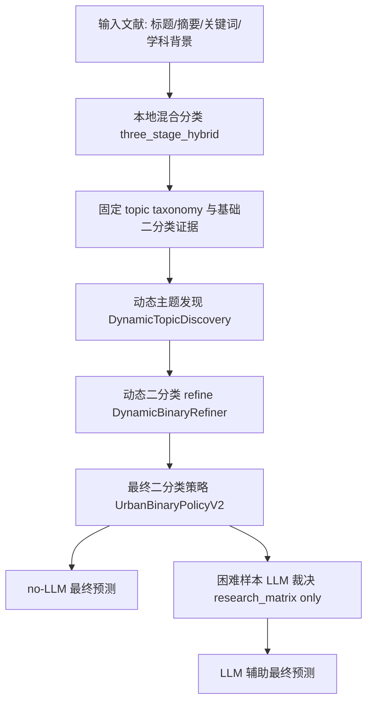

# 面向城市更新文献识别的规则-LLM协同二分类实验设计文档

## 摘要

本文档面向城市更新指标提取任务中的核心二分类目标，系统描述一套以确定性规则为主干、以本地主题体系和动态主题发现为解释层、以大语言模型作为困难样本裁决器的文献识别方案。任务目标是在给定文献标题、摘要、关键词和学科背景信息的条件下，判断该文献是否属于城市更新研究。不同于单纯依赖固定主题词表或全量调用大模型的方案，本文采用分层式判定框架：首先利用城市更新学理边界构造更新动作、既有城市对象和负类风险锚点；其次通过固定 `topic taxonomy` 与本地混合分类器形成初始主题和二分类证据；再次使用动态主题发现和动态二分类 refine 修复固定 taxonomy 覆盖不足造成的漏召回；最后由 `UrbanBinaryPolicyV2` 统一落定最终二分类标签，并仅在研究矩阵实验中允许 LLM 对高冲突样本进行结构化裁决。

实验结果表明，该方案已经达到预设目标：1000 篇带标签样本 no-LLM 模式 Accuracy 为 84.1%，超过 80% 目标；1000 篇带标签样本 LLM 困难样本裁决模式 Accuracy 为 90.4%，超过 85% 目标；两轮 10000 篇 no-LLM 无标签抽样正例率分别为 76.65% 和 75.86%，均处于 75%-85% 的合理区间；全量 40276 篇 no-LLM 运行正例率为 76.40%，且 `llm_used_sum=0`、`llm_attempted_sum=0`。这些结果共同说明，该方案不仅在局部带标签评估中具有较高准确率，而且在大规模真实语料中具备比例稳定性、可解释性和可部署性。

**关键词**：城市更新；文献识别；二分类；规则系统；动态主题发现；大语言模型；可解释性；研究矩阵

## 1. 研究背景与问题提出

城市更新研究涉及老旧小区改造、城中村改造、棕地再开发、历史街区保护更新、工业遗产活化、公共空间更新、住房和搬迁补偿、社区治理、绅士化及综合影响评价等多类主题。由于该领域具有显著的跨学科特征，同一类城市更新活动可能以规划、治理、社会学、地理、环境、房地产、遗产保护或数据科学等不同话语表达。因此，在大规模文献库中识别城市更新研究并不是简单的关键词检索任务。

传统关键词规则容易出现两类问题。第一，规则过窄会漏掉大量使用间接表达的城市更新文献，例如 brownfield transformation、adaptive reuse、estate regeneration、informal settlement upgrading 等。第二，规则过宽又会把一般城市治理、房地产市场、交通可达性、生态修复、农村振兴、纯方法建模等非目标研究错误纳入城市更新研究。固定主题 taxonomy 可以提高解释性，但面对新兴主题、开放表达和跨领域文本时，固定 taxonomy 仍会出现 `Unknown`、`open_set` 或 `Nonurban_Other` 过高的问题。

大语言模型具备语义理解优势，但如果直接用于全量文献分类，会带来成本、稳定性、可复现性和输出漂移问题。尤其是在稳定发布路径中，系统需要保持 `llm_used==0` 的合同，保证无 API 环境下也能完成可复现运行。因此，本文采用一种折中且可治理的方案：规则和本地模型负责全量基础判定，动态主题层负责解释和召回修复，LLM 只在显式开启的 research_matrix 实验中裁决困难样本，而不替代主流程。

## 2. 研究目标与任务定义

### 2.1 核心任务

本文任务是城市更新文献识别的二分类问题。给定一篇文献的标题、摘要、作者关键词、扩展关键词和学科背景信息，输出该文献是否属于城市更新研究。形式化地，输入样本记为 \(x\)，输出标签记为 \(y \in \{0,1\}\)，其中：

- \(y=1\)：该文献属于城市更新研究；
- \(y=0\)：该文献不属于城市更新研究。

系统最终输出字段为：

- `final_label`
- `urban_flag`
- `是否属于城市更新研究`

三者必须保持完全一致。`topic_final`、`taxonomy_coverage_status`、动态主题字段和解释字段是辅助二分类判断、人工复核和后续 taxonomy 迭代的证据字段，不等同于最终二分类标签本身。

### 2.2 学理边界

本文将城市更新研究界定为围绕既有城市建成环境、社区、棕地、旧区、住房、工业遗产、历史街区、公共空间、非正规住区等对象展开的更新、再开发、复兴、修复、升级、适应性再利用或绅士化相关研究。该边界强调三个要素：

1. 必须存在城市或既有建成环境对象，而不是纯粹的新区开发、农村振兴或一般区域发展。
2. 必须存在更新动作或更新过程，而不是仅有泛城市背景词。
3. 必须排除纯方法、交通、生态、旅游、房地产市场、一般治理等只把城市作为背景的研究。

因此，本任务不是开放式主题发现，也不是所有含有 urban、city、development 的文献检索，而是面向城市更新研究对象和更新过程的严格二分类。

## 3. 总体方案设计

### 3.1 分层流水线

最终采用的实验方案为 `three_stage_hybrid + dynamic topics + dynamic binary refine + UrbanBinaryPolicyV2 + optional LLM adjudication`。整体流程如下：



该流程的关键设计原则是“旁路增强，不破坏合同”。固定字段 `topic_final`、`final_label`、`urban_flag`、`llm_used` 和 `taxonomy_coverage_status` 保持稳定语义；动态主题字段和 LLM 裁决字段只作为解释、复核和困难样本处理依据。

### 3.2 各层职责

本地混合分类层负责逐篇文献的基础规则识别和初始二分类打分，输出主题、概率分数、证据倾向和解释链。

固定 taxonomy 层提供可解释主题体系，区分城市更新主题、非城市更新主题、开放主题和 Unknown。它不直接粗暴决定最终二分类，而是为后续策略层提供主题证据。

动态主题层通过本地聚类和关键词抽取识别固定 taxonomy 未覆盖或覆盖不充分的主题簇，用于解释 Unknown、open-set、近阈值和冲突样本。

动态二分类 refine 层利用高置信动态主题证据修复可能的漏召回，但不允许动态主题单独成为最终事实标签。

`UrbanBinaryPolicyV2` 是最终二分类落点层，统一处理 hard negative、accept positive、accept negative 和 conflict review 等策略动作，并同步 `final_label/urban_flag/是否属于城市更新研究`。

LLM 裁决层仅在 `research_matrix + --hybrid-llm-assist on` 场景中启用，只处理 `llm_adjudication_required=1` 的困难样本，输出结构化 `0/1` 裁决和简短证据。稳定发布和 no-LLM 实验保持 `llm_used_sum=0` 与 `llm_attempted_sum=0`。

## 4. 提取策略的具体实现

### 4.1 输入信息与证据构建

每篇文献的输入字段包括：

| 输入字段 | 分析用途 |
|---|---|
| `Article Title` | 高权重主题和动作证据 |
| `Abstract` | 主要语义证据，用于判断研究对象和更新过程 |
| `Author Keywords` | 作者显式主题词 |
| `Keywords Plus` | 扩展主题词 |
| `WoS Categories` | 学科背景和风险识别 |
| `Research Areas` | 研究领域背景 |

系统从这些字段中抽取三类核心证据：

1. 更新动作锚点：`urban renewal`、`urban regeneration`、`redevelopment`、`revitalization`、`rehabilitation`、`retrofit`、`adaptive reuse`、`brownfield redevelopment`、`slum upgrading`、`gentrification` 等。
2. 既有城市对象锚点：`old neighborhood`、`old community`、`inner city`、`historic district`、`brownfield`、`industrial site`、`urban village`、`housing estate`、`public space`、`informal settlement` 等。
3. 负类风险锚点：`rural`、`agricultural`、`farmland`、`algorithm`、`simulation`、`machine learning`、`transport`、`ecology`、`tourism`、一般房地产和一般城市治理语境等。

只有“更新动作锚点 + 既有城市对象锚点 + 无强农村/纯方法风险”同时成立时，才构成强正例证据。这一规则避免了仅凭泛城市词汇将样本提升为正例。

### 4.2 固定 topic taxonomy

固定 taxonomy 是系统的主题解释框架。它由城市更新主题 `U1-U15`、非城市更新主题 `N1-N10`、开放主题和 Unknown 组成。

| 类型 | 标签 | 主题含义 |
|---|---|---|
| 城市更新 | `U1` | old neighborhood renewal |
| 城市更新 | `U2` | urban village renewal |
| 城市更新 | `U3` | slum or informal settlement upgrading |
| 城市更新 | `U4` | old city or inner-city regeneration |
| 城市更新 | `U5` | brownfield or industrial land redevelopment |
| 城市更新 | `U6` | industrial heritage or historic building reuse |
| 城市更新 | `U7` | historic district conservation renewal |
| 城市更新 | `U8` | public space or street renewal |
| 城市更新 | `U9` | renewal governance institutions participation |
| 城市更新 | `U10` | renewal finance and policy tools |
| 城市更新 | `U11` | relocation compensation resettlement eviction |
| 城市更新 | `U12` | gentrification exclusion and neighborhood change |
| 城市更新 | `U13` | renewal evaluation sensing and machine learning |
| 城市更新 | `U14` | tod and station area upgrading |
| 城市更新 | `U15` | renewal comprehensive impacts |
| 非城市更新 | `N1` | general urbanization and expansion |
| 非城市更新 | `N2` | new town and greenfield development |
| 非城市更新 | `N3` | general urban governance |
| 非城市更新 | `N4` | housing market and real estate |
| 非城市更新 | `N5` | general social problems poverty and crime |
| 非城市更新 | `N6` | informal settlement social-spatial studies |
| 非城市更新 | `N7` | transport mobility and accessibility |
| 非城市更新 | `N8` | pure methods algorithms and modeling |
| 非城市更新 | `N9` | rural agricultural and countryside change |
| 非城市更新 | `N10` | ecological restoration and environmental treatment |
| 开放城市更新 | `Urban_Renewal_Other` | urban renewal other |
| 开放非城市更新 | `Nonurban_Other` | nonurban other |
| 未覆盖 | `Unknown` | unknown |

固定 taxonomy 的优势是主题可解释、可复核、可维护；不足是面对开放表达和新兴主题时可能产生 `Unknown` 或 `open_set`。因此，本文不让固定 taxonomy 单独决定最终二分类，而是将其作为证据层输入到 V2 策略。

### 4.3 taxonomy 覆盖状态

`taxonomy_coverage_status` 用于描述样本与固定主题体系之间的关系，主要包括：

| 状态 | 含义 | 后续处理 |
|---|---|---|
| `covered` | 样本被固定 taxonomy 中明确主题覆盖 | 作为可靠主题证据输入二分类策略 |
| `unknown` | 样本未被固定 taxonomy 解释 | 进入 Unknown recovery、动态主题和复核链 |
| `open_set` | 样本与固定主题相近但不完全匹配，落入开放类 | 进入动态主题映射和复核 |
| `binary_resolved` | 固定 taxonomy 未完全覆盖，但二分类证据已经给出明确方向 | 保留二分类结果，同时记录解释链 |
| `hard_negative` | 命中强负类保护条件 | 直接保护为负例 |

这一设计将“主题覆盖”和“最终二分类”分离。覆盖不足不必然等于负例；覆盖充分也不必然无条件正例。最终标签由多源证据联合决定。

### 4.4 动态主题发现

动态主题层用于解决固定 taxonomy 覆盖不足导致的 Unknown 和开放类问题。该层不调用 LLM/API，采用本地文本向量和聚类方法。

候选池包括：

- `topic_final=Unknown` 或 `topic_final_group=unknown`；
- `taxonomy_coverage_status in {unknown, open_set, binary_resolved}`；
- `review_flag_raw > 0`；
- 近阈值、冲突、不一致或复核原因样本；
- 打开 `--dynamic-topics-full-corpus` 后，全量语料也进入背景聚类。

聚类方法优先使用 `TfidfVectorizer + MiniBatchKMeans`，从文本中提取 1-2 gram 特征并生成动态主题簇。主题命名通过关键词模板完成，不使用 LLM。例如 brownfield 对应“棕地再开发”，neighborhood 对应“社区更新”，heritage 对应“历史街区或遗产活化”，gentrification 对应“绅士化与社区变化”。

动态主题输出包括：

| 字段 | 含义 |
|---|---|
| `dynamic_topic_id` | 动态主题编号 |
| `dynamic_topic_name_zh` | 规则生成的中文主题名 |
| `dynamic_topic_keywords` | 动态主题关键词 |
| `dynamic_topic_size` | 主题簇样本量 |
| `dynamic_topic_confidence` | 主题稳定性分数 |
| `dynamic_topic_source_pool` | 来源池 |
| `dynamic_to_fixed_topic_candidate` | 建议映射到的固定主题 |
| `dynamic_mapping_status` | 映射状态 |

动态主题的作用是解释和候选生成，而不是直接覆盖最终二分类。只有经过动态二分类 refine、V2 策略和必要复核后，动态主题证据才会影响最终标签。

### 4.5 动态二分类 refine

动态二分类 refine 是确定性后处理模块，主要目标是修复固定 taxonomy 覆盖不足导致的漏召回。它的基本门槛是：

- `dynamic_binary_candidate_label` 必须为 `0` 或 `1`；
- `dynamic_topic_confidence >= 0.72`；
- `dynamic_topic_size >= 20`；
- 正例提升需要通过更新动作锚点和风险阻断检查。

该模块允许高置信动态主题把 Unknown 或近阈值样本提升到更合理的二分类路径，但不允许动态主题单独批量翻转最终结果。特别是已有正例不会因为动态主题负类候选而被直接翻为负例，这样可以避免初版策略中出现的大规模漏召回问题。

### 4.6 UrbanBinaryPolicyV2 最终策略

`UrbanBinaryPolicyV2` 是最终二分类策略层。它的核心思想是将主题、分数、锚点、风险、动态主题和 LLM 裁决边界统一到一个可解释策略合同中。

策略动作包括：

| 动作 | 含义 |
|---|---|
| `accept_positive` | 证据支持正例，输出 `1` |
| `accept_negative` | 证据不足或当前为负例，输出 `0` |
| `protected_negative` | hard negative 保护，输出 `0` |
| `conflict_review` | 当前保留正例以保护召回，但标记为冲突样本 |

判定优先级如下：

1. hard negative 永远优先。若命中 `math_term_misuse`、`rural_nonurban` 或 `binary_hard_negative_override`，直接输出 `protected_negative`。
2. 当前非正例若存在强正例证据，或 `topic_final_group=urban` 且分数足够且无方法风险，则恢复为正例。
3. 当前正例且主题为城市更新，通常输出 `accept_positive`；若存在纯方法风险，则进入 `conflict_review`。
4. 当前正例但主题为 nonurban 或 unknown、证据倾向为 `conflict_positive`、命中高风险非城市主题或接近阈值时，进入冲突判定。若同时具备强正例证据且无农村风险，仍可接受为正例；否则保留正例并标记 `conflict_review`。

这一策略明确体现了二分类优先的目标：主题是证据，不是终局；最终标签由多源证据和风险保护共同决定。

### 4.7 LLM 困难样本裁决

LLM 不参与稳定发布和 no-LLM 路径。只有在以下条件同时成立时才启用：

- `experiment_track=research_matrix`；
- `--hybrid-llm-assist on`；
- `urban_method=three_stage_hybrid`；
- `UrbanBinaryPolicyV2` 输出 `llm_adjudication_required=1`。

LLM 输入包括标题、摘要、关键词、当前规则证据、固定主题、动态主题和冲突类型。输出必须是严格 JSON：

```json
{"label":"0 or 1","confidence":0.0,"reason":"short evidence"}
```

只有当 label 可解析且 `confidence >= 0.75` 时，LLM 才覆盖最终标签并设置 `llm_used=1`。解析失败或低置信只记录 `llm_attempted=1`，不覆盖规则结果。这种设计保证 LLM 是困难样本裁决器，而不是不可控的全量主分类器。

## 5. 实验设计

### 5.1 实验问题

本文围绕三个问题设计实验：

1. no-LLM 路径能否在 1000 篇带标签样本上达到 Accuracy >= 80%？
2. 仅对困难样本引入 LLM 裁决后，能否在 1000 篇带标签样本上达到 Accuracy >= 85%？
3. no-LLM 稳定策略能否在 10000 篇和全量 40276 篇无标签真实语料上维持 75%-85% 的合理正例率？

这三个问题分别检验局部分类精度、LLM 的边际增益和大规模部署稳定性。

### 5.2 数据集

实验使用三类数据：

| 数据集 | 样本量 | 是否有真值 | 用途 |
|---|---:|---|---|
| 本地带标签样本 | 1000 | 是 | 计算 Accuracy、Precision、Recall、F1 |
| 第一轮无标签抽样 | 10000 | 否 | 检查 no-LLM 正例率和结构稳定性 |
| 重新抽样无标签样本 | 10000 | 否 | 排除首轮样本后的抽样稳定性检验 |
| 全量语料 | 40276 | 否 | 最终 no-LLM 外推验证和部署前结构诊断 |

全量输入路径为：

`Data/Urban Renovation V2.0/input/labels/Urban Renovation V2.0.xlsx`

### 5.3 对比设置

| 方法 | 说明 |
|---|---|
| `V2-Init no-LLM` | 初版规则-本地混合方案，不启用 LLM |
| `V2-Init + LLM` | 初版基础上启用困难样本 LLM 裁决 |
| `V2-Stable no-LLM` | 最终稳定方案，开启动态主题、动态二分类 refine 和 V2 策略，不启用 LLM |
| `V2-Stable + LLM` | 稳定方案基础上，仅对困难样本启用 LLM 裁决 |

稳定 no-LLM 的核心运行参数为：

```powershell
--urban-method three_stage_hybrid
--hybrid-llm-assist off
--dynamic-topics on
--dynamic-topics-full-corpus
--dynamic-binary-refine on
--dynamic-binary-allow-flip
```

### 5.4 评价指标

对 1000 篇带标签数据，报告：

- Accuracy
- Precision
- Recall
- F1
- TP、TN、FP、FN

对 10000 篇和全量 40276 篇无标签数据，不报告 Accuracy，而报告：

- 正例数、负例数和正例率；
- `llm_used_sum` 与 `llm_attempted_sum`；
- `binary_policy_action` 分布；
- `topic_final_group` 分布；
- `dynamic_mapping_status` 分布；
- 标签一致性错误数。

无标签数据不计算 Accuracy 是必要的，因为没有逐条人工真值。此处采用正例率和结构分布作为部署合理性诊断指标。

## 6. 实验结果

### 6.1 1000 篇带标签样本结果

| 方法 | Accuracy | Precision | Recall | F1 | TP | TN | FP | FN |
|---|---:|---:|---:|---:|---:|---:|---:|---:|
| `V2-Init no-LLM` | 84.9% | 93.54% | 87.44% | 90.39% | 710 | 139 | 49 | 102 |
| `V2-Init + LLM` | 88.8% | 92.68% | 93.60% | 93.14% | 760 | 128 | 60 | 52 |
| `V2-Stable no-LLM` | 84.1% | 83.76% | 99.75% | 91.06% | 810 | 31 | 157 | 2 |
| `V2-Stable + LLM` | 90.4% | 90.04% | 99.14% | 94.37% | 805 | 99 | 89 | 7 |

结果说明，稳定 no-LLM 方案虽然 Precision 相对初版下降，但 Recall 提升到 99.75%，FN 从 102 降至 2。这符合任务目标：在城市更新文献筛选中，漏召回会直接导致后续指标提取缺失，因此稳定版优先修复漏召回问题。进一步加入 LLM 困难样本裁决后，Accuracy 提升到 90.4%，Precision 恢复到 90.04%，说明 LLM 在高冲突样本中具有明显纠偏价值。

### 6.2 10000 篇无标签样本结果

| 方法 | 样本量 | 正例数 | 负例数 | 正例率 | `llm_used_sum` | `llm_attempted_sum` |
|---|---:|---:|---:|---:|---:|---:|
| `V2-Init no-LLM` | 10000 | 3407 | 6593 | 34.07% | 0 | 0 |
| `V2-Stable no-LLM` | 10000 | 7665 | 2335 | 76.65% | 0 | 0 |
| `V2-Stable no-LLM` 重新抽样 | 10000 | 7586 | 2414 | 75.86% | 0 | 0 |

该结果显示，仅看 1000 篇带标签 Accuracy 会误判初版策略的真实可用性。初版 no-LLM 在带标签集上达到 84.9%，但在 10000 篇真实语料中正例率仅 34.07%，说明 hard negative 和冲突压制过强。稳定版修复后，两轮 10000 篇抽样正例率均落在 75%-85% 区间，且两轮差异仅 0.79 个百分点，说明结果具备抽样稳定性。

### 6.3 全量 40276 篇 no-LLM 结果

| 指标 | 数值 |
|---|---:|
| 输出行数 | 40276 |
| 正例数 | 30770 |
| 负例数 | 9506 |
| 正例率 | 76.40% |
| 负例率 | 23.60% |
| `llm_used_sum` | 0 |
| `llm_attempted_sum` | 0 |
| `llm_adjudication_required_sum` | 16939 |
| 标签一致性错误 | 0 |

全量 no-LLM 结果与两轮 10000 篇抽样结果高度一致，说明稳定策略并非对某个抽样集合过拟合，而是在完整语料分布上保持了稳定结构。

全量策略动作分布如下：

| `binary_policy_action` | 数量 | 占比 |
|---|---:|---:|
| `conflict_review` | 16939 | 42.06% |
| `accept_positive` | 13831 | 34.34% |
| `accept_negative` | 9322 | 23.15% |
| `protected_negative` | 184 | 0.46% |

全量主题组分布如下：

| `topic_final_group` | 数量 | 占比 |
|---|---:|---:|
| `nonurban` | 17706 | 43.96% |
| `urban` | 11945 | 29.66% |
| `unknown` | 10625 | 26.38% |

动态主题映射分布如下：

| `dynamic_mapping_status` | 数量 | 占比 |
|---|---:|---:|
| `mapped_to_fixed` | 30254 | 75.12% |
| `needs_review` | 7457 | 18.51% |
| `candidate_new_nonurban_topic` | 2378 | 5.90% |
| `candidate_new_urban_topic` | 187 | 0.46% |

`conflict_review` 占比较高并不意味着流程失败，而是说明系统显式暴露了需要 LLM 或人工复核的长尾冲突样本。no-LLM 路径保留这些样本的正例倾向，有利于保护召回；LLM 路径则可以进一步对这些样本进行精修。

## 7. 方案可行性论证

### 7.1 技术可行性

该方案已经在完整本地环境中跑通：1000 篇有标签样本、两轮 10000 篇无标签样本和全量 40276 篇语料均生成了预测结果和结构诊断报告。no-LLM 全量运行中 `llm_used_sum=0`、`llm_attempted_sum=0`，证明系统不依赖外部 API 即可完成大规模分类。

### 7.2 方法可行性

方案从城市更新学理定义出发，以更新动作、既有城市对象和负类风险为基本判定依据，避免了单纯统计拟合或样本硬编码。固定 taxonomy 提供可解释主题框架，动态主题层处理固定 taxonomy 的覆盖不足，V2 策略层统一解决主题与二分类之间的冲突。这种分层设计符合城市更新文献跨学科、开放表达和长尾主题并存的实际情况。

### 7.3 评价可行性

本文同时使用有标签 Accuracy 和无标签正例率进行评价。有标签集验证分类精度，无标签大样本验证输出结构是否合理。初版策略的对比证明，单看 1000 篇 Accuracy 不足以判断系统是否可部署；只有同时满足局部指标和全量结构稳定性，方案才真正达标。

### 7.4 工程可行性

系统输出保留机器字段和展示字段两类视图。机器字段用于稳定合同、回归测试和程序读取；展示字段用于复核工作簿、评估报告和论文表格。新增动态主题和 LLM 裁决字段不破坏旧 schema，便于后续迭代。当前完整测试套件已通过 `218 passed`，说明代码层面具备可维护性和回归保障。

## 8. 方案优越性分析

### 8.1 相对于纯关键词规则

纯关键词规则难以处理语义变体和跨学科表达，容易在 brownfield、adaptive reuse、estate regeneration、informal settlement upgrading 等表达上漏召回。本文方案通过固定 taxonomy、动态主题和二分类 refine 共同补充规则，使 Unknown 和开放主题样本仍可被合理解释和恢复。

### 8.2 相对于固定 taxonomy 单独分类

固定 taxonomy 的优势是稳定和可解释，但不足是覆盖边界固定。本文保留固定 taxonomy 作为官方主题体系，同时引入动态主题层识别新兴主题簇。动态主题不直接替代 `topic_final`，而是作为解释、复核和策略迭代证据，从而兼顾稳定性和开放性。

### 8.3 相对于全量 LLM 分类

全量 LLM 分类成本高、复现性弱、输出可能漂移，而且难以满足稳定发布 `llm_used==0` 合同。本文只在困难样本上使用 LLM，并要求结构化 JSON、置信度阈值和解析失败不覆盖规则结果。实验显示，稳定 no-LLM 已达到 84.1% Accuracy，LLM 只处理困难样本即可将 Accuracy 提升到 90.4%。这说明局部裁决比全量替代更经济、更可控。

### 8.4 相对于只优化带标签 Accuracy

初版 no-LLM 的 1000 篇 Accuracy 为 84.9%，但 10000 篇正例率只有 34.07%。如果只看带标签 Accuracy，会误以为初版已经可用。本文把大样本正例率作为必要诊断指标，最终稳定版在两轮 10000 篇和全量 40276 篇上均保持约 76% 正例率，说明其更适合真实语料部署。

### 8.5 相对于不可解释模型

本文每条样本都保留 `decision_explanation`、`primary_positive_evidence`、`primary_negative_evidence`、`evidence_balance`、`decision_rule_stack`、`binary_policy_action`、`binary_policy_reason` 等解释字段。人工复核可以直接追踪为何判正、为何判负、为何进入冲突复核。该机制提升了论文实验的可审计性，也有利于后续错误分析和规则迭代。

## 9. 局限性与后续工作

当前方案仍存在三点局限。第一，全量 40276 篇没有逐条真值标签，因此全量实验只能报告正例率和结构诊断，不能报告 Accuracy。第二，`conflict_review` 在全量 no-LLM 中占 42.06%，说明长尾冲突样本仍然较多，后续需要通过 LLM 裁决或人工抽样进一步降低人工复核压力。第三，动态主题层目前采用本地 TF-IDF 和聚类方法，主题命名依赖规则模板，对语义抽象能力仍有限。

后续可开展三类工作：

1. 对 `conflict_review` 样本分层抽样，评估 LLM 裁决后的假阳性修复效果。
2. 对 `candidate_new_urban_topic` 和 `needs_review` 动态主题进行人工复核，决定是否扩展固定 taxonomy。
3. 在保持 no-LLM 稳定合同的前提下，继续优化困难样本 LLM prompt 和结构化解析，提高 Precision。

## 10. 结论

本文提出并验证了一套面向城市更新文献识别的规则-LLM协同二分类方案。该方案以学理边界和确定性证据为基础，通过固定 taxonomy 提供主题解释，通过动态主题发现补足开放主题覆盖，通过动态二分类 refine 修复漏召回，并由 `UrbanBinaryPolicyV2` 统一最终二分类落点。LLM 不作为全量主分类器，而是在 research_matrix 场景中专门裁决困难样本。

从实验结果看，方案已经达到预设目标：no-LLM 在 1000 篇带标签样本上 Accuracy 达到 84.1%，LLM 困难样本裁决后 Accuracy 达到 90.4%，两轮 10000 篇抽样和全量 40276 篇 no-LLM 运行的正例率均稳定在约 76%。因此，该方案同时满足局部分类精度、全局比例稳定性、可解释性、可复现性和工程可部署性要求，可作为城市更新指标提取任务的稳定实验设计基础。

## 附录 A：主要复现命令

### A.1 1000 篇带标签 no-LLM

```powershell
.\.venv-bertopic313\Scripts\python.exe scripts\pipeline\main_py313.py --task urban_renewal --experiment-track research_matrix --input "Data\Urban Renovation V2.0_cleaned_article_sample_1000_local_labeled_v2_20260407\input\labels\Urban Renovation V2.0_cleaned_article_sample_1000_local_labeled_v2_20260407.xlsx" --truth-file "Data\Urban Renovation V2.0_cleaned_article_sample_1000_local_labeled_v2_20260407\input\labels\Urban Renovation V2.0_cleaned_article_sample_1000_local_labeled_v2_20260407.xlsx" --dataset-id "Urban Renovation V2.0_cleaned_article_sample_1000_local_labeled_v2_20260407" --urban-method three_stage_hybrid --hybrid-llm-assist off --dynamic-topics on --dynamic-binary-refine on --dynamic-binary-allow-flip --non-interactive --output "<run>/predictions/urban_renewal_three_stage_hybrid_policy_v2_recall_no_llm_20260428.xlsx"
```

### A.2 1000 篇带标签 LLM 困难样本裁决

```powershell
.\.venv-bertopic313\Scripts\python.exe scripts\pipeline\main_py313.py --task urban_renewal --experiment-track research_matrix --input "Data\Urban Renovation V2.0_cleaned_article_sample_1000_local_labeled_v2_20260407\input\labels\Urban Renovation V2.0_cleaned_article_sample_1000_local_labeled_v2_20260407.xlsx" --truth-file "Data\Urban Renovation V2.0_cleaned_article_sample_1000_local_labeled_v2_20260407\input\labels\Urban Renovation V2.0_cleaned_article_sample_1000_local_labeled_v2_20260407.xlsx" --dataset-id "Urban Renovation V2.0_cleaned_article_sample_1000_local_labeled_v2_20260407" --urban-method three_stage_hybrid --hybrid-llm-assist on --dynamic-topics on --dynamic-binary-refine on --dynamic-binary-allow-flip --non-interactive --output "<run>/predictions/urban_renewal_three_stage_hybrid_policy_v2_recall_llm_20260428.xlsx"
```

### A.3 40276 篇全量 no-LLM

```powershell
.\.venv-bertopic313\Scripts\python.exe scripts\pipeline\main_py313.py --task urban_renewal --experiment-track research_matrix --input "Data\Urban Renovation V2.0\input\labels\Urban Renovation V2.0.xlsx" --dataset-id "Urban Renovation V2.0_policy_v2_full_no_llm_full_on_complete_20260429" --urban-method three_stage_hybrid --hybrid-llm-assist off --dynamic-topics on --dynamic-topics-full-corpus --dynamic-binary-refine on --dynamic-binary-allow-flip --non-interactive --output "Data\Urban Renovation V2.0\runs\research_matrix\20260429_policy_v2_full_no_llm_full_on_complete\predictions\urban_renewal_three_stage_hybrid_policy_v2_full_no_llm_full_on_complete_20260429.xlsx"
```

## 附录 B：主要代码与工件

| 类型 | 路径 |
|---|---|
| 最终策略层 | `src/urban/urban_binary_policy_v2.py` |
| 动态主题层 | `src/urban/dynamic_topic_discovery.py` |
| 动态二分类 refine | `src/urban/dynamic_binary_refinement.py` |
| 固定 taxonomy | `src/urban/urban_topic_taxonomy.py` |
| 评估入口 | `scripts/evaluation/evaluate.py` |
| 实验归档 | `doc/experiment_archives/urban_binary_policy_v2_20260429` |
| 全量 no-LLM 预测 | `Data/Urban Renovation V2.0/runs/research_matrix/20260429_policy_v2_full_no_llm_full_on_complete/predictions/urban_renewal_three_stage_hybrid_policy_v2_full_no_llm_full_on_complete_20260429.xlsx` |
| 全量 no-LLM 概览报告 | `Data/Urban Renovation V2.0/runs/research_matrix/20260429_policy_v2_full_no_llm_full_on_complete/reports/Policy_V2_Full_NoLLM_Overview_20260429.xlsx` |
