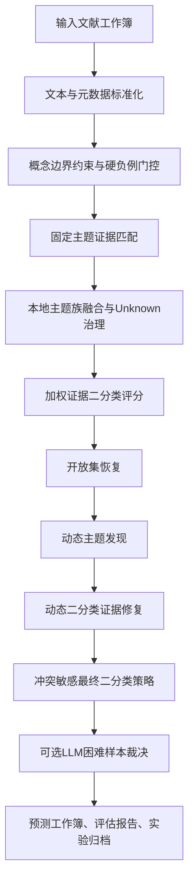

# 城市更新指标提取完整技术方案（技术路线图版）

生成日期：2026-05-07

适用范围：本文档描述当前城市更新指标提取任务的完整技术方案，重点面向后续技术路线图、论文方法部分、进度汇报和人工复核组织。方案以“规则约束 + 动态主题发现 + 动态二分类修复 + 困难样本 LLM 裁决”为主线，最终目标不是主题分类本身，而是稳定、可解释、可复现地完成城市更新研究二分类。

## 1. 任务目标与核心合同

城市更新指标提取任务的最终产物是逐篇文献的城市更新二分类结果。系统需要判断一篇文献是否属于城市更新研究，并输出可追溯的证据链。

核心二分类字段必须保持一致：

| 字段 | 含义 | 合同要求 |
|---|---|---|
| `final_label` | 最终二分类标签 | `1` 表示城市更新研究，`0` 表示非城市更新研究 |
| `urban_flag` | 运行层二分类标记 | 必须与 `final_label` 一致 |
| `是否属于城市更新研究` | 中文输出标签 | 必须与 `final_label` 一致 |

辅助字段不直接等同于最终标签：

| 字段 | 定位 |
|---|---|
| `topic_final` | 固定主题体系下的主题解释标签 |
| `topic_final_group` | 固定主题组，取值为 `urban` / `nonurban` / `unknown` |
| `taxonomy_coverage_status` | 固定主题体系覆盖状态 |
| `dynamic_topic_*` | 动态主题发现层的解释证据 |
| `binary_policy_action` | V2 二分类策略的最终动作 |
| `llm_adjudication_*` | LLM 困难样本裁决证据，仅在允许 LLM 的 research_matrix 路径生效 |

no-LLM 路径的稳定合同：

| 指标 | 要求 |
|---|---|
| `llm_used_sum` | 必须为 `0` |
| `llm_attempted_sum` | 必须为 `0` |
| API 调用 | 不调用 LLM/API |

LLM 路径的边界：

- LLM 不替代全量规则。
- LLM 只处理规则标记为困难或冲突的样本。
- LLM 只有在结构化解析成功且置信度达到阈值时才覆盖最终标签。

## 2. 学术定义与分类边界

本任务采用“既有城市建成环境更新”作为城市更新研究的判定核心。正例并不只是包含 urban 或 renewal 词汇，而必须体现研究对象、更新行动和城市语境之间的证据闭环。

### 2.1 正例定义

一篇文献判为城市更新研究，通常需要满足以下条件之一：

| 条件 | 说明 | 典型证据 |
|---|---|---|
| 既有城市建成环境 + 更新行动 | 研究对象是已有城区、社区、街区、住房、棕地、工业遗产、公共空间等，且存在更新、再开发、复兴、修复、改造等过程 | regeneration, redevelopment, renewal, adaptive reuse, brownfield, old neighborhood |
| 城市更新政策与治理 | 研究内容是城市更新相关政策、融资、治理、补偿、搬迁、公众参与或实施机制 | land value capture, compensation, relocation, urban renewal policy |
| 城市更新影响评价 | 研究城市更新对社会、空间、健康、经济、环境或社区结构的影响 | gentrification, displacement, neighborhood change |
| 开放集城市更新 | 固定 taxonomy 未覆盖，但出现明确更新动作和既有城市对象 | existing district + retrofit, urban fabric + rehabilitation |

### 2.2 负例边界

以下情况原则上判为非城市更新研究：

| 负例类型 | 排除原因 | 典型证据 |
|---|---|---|
| 农村更新或乡村振兴 | 研究对象不是城市建成环境 | rural regeneration, village revitalization |
| 新城或绿地扩张 | 重点是城市扩张或新区建设，不是既有空间更新 | new town, greenfield, sprawl |
| 泛城市治理 | 只有城市政策、治理或社会问题，没有更新对象和行动 | general urban governance, urban politics |
| 纯方法或算法 | 只是模型、遥感、算法或工程方法，城市更新只是背景或应用场景 | finite element, algorithm, simulation |
| 交通、生态、旅游、污染治理 | 主题可发生在城市，但不是城市更新过程本身 | transport accessibility, ecological restoration, tourism |
| 数学或术语误用 | urban renewal 出现在非城市研究语境，如数学术语或材料工程语境 | dimer, bipartite graph, recycled concrete |

## 3. 总体技术路线

当前方案可以概括为十一个连续节点。技术路线图制作时，可把“最终二分类策略”作为主干，把“固定主题”和“动态主题”放在两侧作为证据层。



技术路线节点表：

| 阶段 | 学术化方法名称 | 主要作用 | 核心输出 |
|---|---|---|---|
| 0 | 文献元数据标准化 | 统一标题、摘要、关键词、学科背景输入 | 标准化运行表 |
| 1 | 概念边界约束门控 | 排除明显非目标样本，保留候选证据 | `metadata_route`、`stage1_risk_tags` |
| 2 | 固定主题体系匹配 | 将样本映射到城市更新/非城市更新主题 taxonomy | `topic_final`、`topic_final_group` |
| 3 | 多源主题族融合 | 融合规则、局部主题和 BERTopic 辅助信号 | `family_predicted_family`、`topic_final` |
| 4 | 加权证据二分类评分 | 生成二分类概率分和初步标签 | `urban_probability_score`、`final_label` |
| 5 | 开放集与 Unknown 恢复 | 修复固定 taxonomy 覆盖不足样本 | `taxonomy_coverage_status`、`unknown_recovery_path` |
| 6 | 动态主题发现 | 从 unknown/review/full corpus 中发现新兴主题簇 | `dynamic_topic_*` |
| 7 | 动态二分类证据修复 | 用高置信动态主题补召疑似漏判样本 | `dynamic_binary_override_*` |
| 8 | 冲突敏感最终策略 | 统一最终标签，保护 hard negative，标记冲突 | `binary_policy_action` |
| 9 | LLM 困难样本裁决 | 对冲突样本进行结构化二分类裁决 | `llm_adjudication_*` |
| 10 | 可解释评估与归档 | 输出复核、评估和实验记录 | `Eval_Summary.xlsx`、归档文档 |

## 4. 输入数据与运行配置

### 4.1 输入字段

| 输入字段 | 用途 |
|---|---|
| `Article Title` | 标题证据，权重最高，参与规则匹配、动态主题、LLM 裁决 |
| `Abstract` | 摘要证据，提供研究对象、方法和结论语境 |
| `Author Keywords` | 作者关键词，补充主题锚点 |
| `Keywords Plus` | 扩展关键词，辅助主题和学科语境 |
| `Keywords` | 合并关键词字段 |
| `WoS Categories` | 学科类别，用于识别 hard negative 和相关学科 |
| `Research Areas` | 研究领域背景 |

### 4.2 推荐运行参数

全量 no-LLM 完整流程：

```powershell
.\.venv-bertopic313\Scripts\python.exe scripts\pipeline\main_py313.py `
  --task urban_renewal `
  --experiment-track research_matrix `
  --input "Data\Urban Renovation V2.0\input\labels\Urban Renovation V2.0.xlsx" `
  --dataset-id "Urban Renovation V2.0_policy_v2_full_no_llm_full_on_complete_20260429" `
  --urban-method three_stage_hybrid `
  --hybrid-llm-assist off `
  --dynamic-topics on `
  --dynamic-topics-full-corpus `
  --dynamic-binary-refine on `
  --dynamic-binary-allow-flip `
  --non-interactive
```

有 LLM 困难样本裁决路径：

```powershell
.\.venv-bertopic313\Scripts\python.exe scripts\pipeline\main_py313.py `
  --task urban_renewal `
  --experiment-track research_matrix `
  --urban-method three_stage_hybrid `
  --hybrid-llm-assist on `
  --dynamic-topics on `
  --dynamic-topics-full-corpus `
  --dynamic-binary-refine on `
  --dynamic-binary-allow-flip `
  --non-interactive
```

## 5. 固定主题体系（topic taxonomy）

固定 taxonomy 是先验主题体系，作用是提供解释和风险边界。它不是最终二分类的唯一依据。最终二分类由 V2 策略统一决定。

城市更新主题：

| 标签 | 主题 |
|---|---|
| `U1` | old neighborhood renewal |
| `U2` | urban village renewal |
| `U3` | slum or informal settlement upgrading |
| `U4` | old city or inner-city regeneration |
| `U5` | brownfield or industrial land redevelopment |
| `U6` | industrial heritage or historic building reuse |
| `U7` | historic district conservation renewal |
| `U8` | public space or street renewal |
| `U9` | renewal governance institutions participation |
| `U10` | renewal finance and policy tools |
| `U11` | relocation compensation resettlement eviction |
| `U12` | gentrification exclusion and neighborhood change |
| `U13` | renewal evaluation sensing and machine learning |
| `U14` | tod and station area upgrading |
| `U15` | renewal comprehensive impacts |
| `Urban_Renewal_Other` | 城市更新开放补充主题 |

非城市更新主题：

| 标签 | 主题 |
|---|---|
| `N1` | general urbanization and expansion |
| `N2` | new town and greenfield development |
| `N3` | general urban governance |
| `N4` | housing market and real estate |
| `N5` | general social problems poverty and crime |
| `N6` | informal settlement social-spatial studies |
| `N7` | transport mobility and accessibility |
| `N8` | pure methods algorithms and modeling |
| `N9` | rural agricultural and countryside change |
| `N10` | ecological restoration and environmental treatment |
| `Nonurban_Other` | 非城市更新开放补充主题 |

taxonomy 覆盖状态：

| 状态 | 含义 | 后续处理 |
|---|---|---|
| `covered` | 固定 taxonomy 已覆盖，且主题不是开放集或 Unknown | 进入二分类策略 |
| `unknown` | 固定规则无法可靠映射主题 | 进入 Unknown recovery、动态主题、复核或 LLM 裁决 |
| `open_set` | 固定 taxonomy 未覆盖但出现开放集证据 | 保留开放集主题，并进入动态主题解释 |
| `binary_resolved` | 原始主题不明确，但二分类/动态 refine 已修复到明确主题 | 保留修复证据 |
| `hard_negative` | 明确非目标样本 | 直接负例保护 |

## 6. 技术方法与规则细节

### 6.1 文献元数据标准化

学术化名称：文献证据单元标准化。

输入标题、摘要、关键词、学科类别和研究领域。系统统一进行空值处理、文本拼接、大小写与短语规范化，使后续规则匹配、主题打分和动态聚类都基于同一证据单元。

输出包括标准化文本、元数据记录和运行上下文字段。该步骤不做最终判断，只保证后续规则读取同一文本证据。

### 6.2 概念边界约束与硬负例门控

学术化名称：概念边界约束门控。

目的：在进入复杂主题融合前，先排除明显不属于城市更新研究的样本，防止术语误用和非城市语境污染正例。

硬负例触发：

| 触发类型 | 规则 |
|---|---|
| 数学术语误用 | 同时出现 `urban renewal` 与 dimer、bipartite graph、tiling、cluster algebra 等非城市术语 |
| 农村非城市语境 | 出现 rural regeneration、rural renewal、village revitalization、agricultural regeneration 等 |
| 高风险学科背景 | mechanics、materials science、physics applied、geochemistry 等与城市更新弱相关学科 |

风险标记：

| 风险标记 | 含义 | 对后续影响 |
|---|---|---|
| `background_support_risk` | 城市更新只是背景支持语境 | 二分类分数下调 |
| `social_history_media_risk` | 社会史、媒介、记忆叙事风险 | 二分类分数下调 |
| `greenfield_expansion_risk` | 新区、扩张、绿地开发 | 二分类分数下调 |
| `generic_technical_risk` | 纯方法、算法、工程模型 | 二分类分数下调 |
| `explicit_renewal_wording_but_other_object` | 有 renewal 词但对象不是城市更新对象 | 轻微上调或进入冲突 |

若触发 hard negative，直接输出 `taxonomy_coverage_status=hard_negative`，最终二分类强制为 `0`，后续动态主题或 LLM 不能提升为正例。

### 6.3 固定主题证据匹配

学术化名称：证据锚点驱动的固定主题匹配。

该步骤对标题和摘要进行主题打分，主题 seed 来自 U/N taxonomy。每个主题包含种子词、上下文词、组合规则、排除词等证据。系统计算候选主题分数、top3、margin 和高置信标记。

高置信固定主题一般需要：

| 条件 | 阈值 |
|---|---|
| 最优主题得分较高且 margin 充分 | `score >= 6.0` 且 `margin >= 3.0` |
| 或有组合规则命中 | `score >= 5.0` 且存在 combo hits |
| 低分拦截 | `score < 4.0` 或 `margin < 2.0` 不能作为高置信 |

输出字段：

| 字段 | 含义 |
|---|---|
| `topic_rule` | 规则匹配主题 |
| `topic_rule_group` | 规则主题组 |
| `topic_rule_score` | 规则主题分 |
| `topic_rule_margin` | top1 与 top2 差距 |
| `topic_rule_top3` | 前三候选主题 |
| `review_flag_rule` | 规则层是否触发复核 |

### 6.4 多源主题族融合

学术化名称：多源主题族一致性融合。

该步骤融合三类主题证据：

| 证据源 | 作用 |
|---|---|
| 规则主题 | 高精度边界控制 |
| 本地主题分类器 | 弥补规则词覆盖不足 |
| BERTopic 辅助信号 | 提供聚类语义提示，仅作为辅助证据 |

BERTopic 在当前方案中是辅助信号，不直接覆盖最终标签。其作用是：

- 支持规则/本地主题一致时提高可信度。
- 当主题冲突时标记 `bertopic_hint_conflict_flag`。
- 对 Unknown recovery 提供额外提示。

融合后输出：

| 字段 | 含义 |
|---|---|
| `family_predicted_family` | 主题族预测结果 |
| `family_probability_urban` | 城市更新主题族概率 |
| `family_decision_source` | 主题族决策来源 |
| `topic_final` | 融合后的固定主题 |
| `topic_final_group` | `urban` / `nonurban` / `unknown` |

### 6.5 加权证据二分类评分

学术化名称：加权多证据二分类评分。

系统将主题族概率、局部主题二分类概率、主题投票、锚点证据、LLM hint、风险调整和策略调整综合成 `urban_probability_score`。

核心公式：

```text
score =
  0.40 * family_probability
+ 0.25 * topic_binary_probability
+ 0.20 * topic_vote_probability
+ 0.10 * anchor_probability
+ 0.05 * llm_hint_probability
+ risk_adjustment
+ decision_adjustment
```

默认二分类阈值：

| 参数 | 默认值 |
|---|---:|
| `URBAN_BINARY_DECISION_THRESHOLD` | `0.45` |
| `URBAN_BINARY_LOW_CONFIDENCE_REVIEW_FLOOR` | `0.60` |

风险调整：

| 风险 | 调整 |
|---|---:|
| `generic_technical_risk` | `-0.06` |
| `background_support_risk` | `-0.08` |
| `social_history_media_risk` | `-0.06` |
| `greenfield_expansion_risk` | `-0.12` |
| `explicit_renewal_wording_but_other_object` | `+0.03` |

召回校准：

| 校准类型 | 分数地板 |
|---|---:|
| 城市更新固定主题 | `0.56` |
| 核心更新锚点 | `0.58` |
| 广义更新锚点 + 城市语境 | `0.52` |
| 城市主题证据 + 对象/机制/语境 | `0.50` |
| 上下文相关性修复 | `0.46` |

若 hard negative 触发，则直接设置：

| 字段 | 值 |
|---|---|
| `urban_probability_score` | `0.02` |
| `final_label` | `0` |
| `binary_decision_source` | `binary_hard_negative_override` |
| `binary_recall_calibration_tier` | `hard_negative` |

### 6.6 开放集恢复与 Unknown 治理

学术化名称：开放世界主题恢复。

固定 taxonomy 不可能覆盖所有新兴城市更新主题，因此系统引入 open-set 和 Unknown recovery。

开放集城市更新证据要求：

- 出现核心或广义更新动作词。
- 出现既有城市建成环境对象。
- 标题中存在动作或对象锚点，或摘要中行动、对象、政策项目证据同时成立。
- 不存在农村、绿地扩张、纯方法等高风险。

若满足开放集证据，输出：

| 字段 | 值 |
|---|---|
| `open_set_flag` | `1` |
| `open_set_topic` | `Urban_Renewal_Other` |
| `taxonomy_coverage_status` | `open_set` |
| `review_flag` | `1` |

若无法恢复，保留：

| 字段 | 值 |
|---|---|
| `topic_final` | `Unknown` |
| `taxonomy_coverage_status` | `unknown` |
| `review_flag` | `1` |

### 6.7 动态主题发现

学术化名称：局部语料自适应主题发现。

动态主题层用于解决固定 taxonomy 覆盖不足问题。它首先作为解释层和复核层，随后可通过严格门槛参与动态二分类修复。

候选池：

| 来源池 | 进入条件 |
|---|---|
| `unknown_pool` | `topic_final=Unknown` 或 `topic_final_group=unknown` |
| `review_pool` | `taxonomy_coverage_status` 为 unknown/open_set/binary_resolved，或复核原因含 conflict、near_threshold 等 |
| `nonurban_review_pool` | 当前负例但存在 review/uncertain/anchor_guard 信号 |
| `full_corpus_pool` | 打开 `--dynamic-topics-full-corpus` 后，全语料背景聚类 |

本地聚类方法：

| 步骤 | 技术细节 |
|---|---|
| 文本向量化 | `TfidfVectorizer`，1-2 gram，英文停用词，最多 `5000` 特征 |
| 聚类算法 | `MiniBatchKMeans` |
| 默认最小主题规模 | `20` |
| 最大主题数 | `60` |
| 随机种子 | `20260427` |
| 降级路径 | sklearn 失败时使用关键词桶聚类 |

动态主题置信度：

```text
confidence =
  0.45 * size_component
+ 0.35 * mapping_score_component
+ 0.20 * keyword_component
```

固定主题映射：

| 状态 | 规则 |
|---|---|
| `mapped_to_fixed` | 动态关键词与固定 taxonomy 种子词重叠超过 `0.12` |
| `candidate_new_urban_topic` | 无固定映射，但有城市更新动作锚点 |
| `candidate_new_nonurban_topic` | 命中 rural、transport、algorithm、ecology、tourism 等非目标词 |
| `needs_review` | 证据不足，需要人工复核 |

### 6.8 动态二分类证据修复

学术化名称：动态主题约束的召回修复。

该步骤允许高置信动态主题修复固定 taxonomy 造成的漏召，但不允许动态主题无门槛地批量覆盖最终标签。

基础门槛：

| 参数 | 默认值 |
|---|---:|
| `dynamic_topic_confidence` | `>= 0.72` |
| `dynamic_topic_size` | `>= 20` |
| `near_threshold_margin` | `0.08` |

正例修复规则：

| 场景 | 是否允许修复为正例 |
|---|---|
| Unknown 样本 | 需要核心更新动作锚点，且无农村风险 |
| 已有负例转正 | 需要 review 或 near-threshold，并通过 anchor gate |
| 动态主题映射到城市更新主题 | 需要关键词中仍有 renewal、regeneration、redevelopment、brownfield、slum、retrofit 等二分类城市更新锚点 |
| 已有正例转负例 | 默认不允许，避免大批量漏召 |

应用后会更新：

| 字段 | 说明 |
|---|---|
| `dynamic_binary_override_applied` | 是否应用修复 |
| `dynamic_binary_override_label` | 修复标签 |
| `dynamic_binary_override_topic` | 修复主题 |
| `dynamic_binary_override_reason` | 修复证据 |
| `final_label` / `urban_flag` / `是否属于城市更新研究` | 同步最终标签 |
| `topic_final` / `topic_final_group` / `taxonomy_coverage_status` | 同步修复后的主题解释 |

### 6.9 冲突敏感最终二分类策略

学术化名称：冲突敏感最终判定策略。

V2 策略是最终二分类落点。它将前面各层证据统一为四种动作：

| 动作 | 含义 |
|---|---|
| `accept_positive` | 接受正例 |
| `accept_negative` | 接受负例 |
| `protected_negative` | hard negative 保护负例 |
| `conflict_review` | 保留召回，同时标记冲突并进入 LLM/人工裁决队列 |

规则优先级：

| 优先级 | 规则 |
|---|---|
| 1 | hard negative 永远优先，输出 `protected_negative` 和最终标签 `0` |
| 2 | 当前非正例但有强正例证据，可恢复为正例 |
| 3 | `topic_final_group=urban` 且当前正例，通常接受正例 |
| 4 | 城市主题正例但存在方法风险且无强正例证据，进入 `conflict_review` |
| 5 | `topic_final_group in {nonurban, unknown}` 且当前正例，必须检查冲突 |
| 6 | 若冲突样本同时有核心更新动作、既有城市对象且无农村风险，接受正例 |
| 7 | 否则 no-LLM 下保留正例但标记 `conflict_review`，LLM 模式下进入裁决 |

冲突类型：

| 冲突类型 | 说明 |
|---|---|
| `binary_topic_inconsistency` | 二分类标签与主题组不一致 |
| `conflict_positive` | 正负证据冲突但当前为正例 |
| `binary_positive_nonurban_topic` | 非城市主题下的正例 |
| `binary_positive_unknown_topic` | Unknown 主题下的正例 |
| `high_risk_nonurban_topic_N*` | 高风险非城市主题下的正例 |
| `method_only_or_background_context` | 方法或背景语境风险 |
| `near_threshold` | 分数距离阈值不超过 `0.03` |
| `dynamic_topic_negative_candidate` | 动态主题建议负例 |

强正例证据定义：

```text
强正例 = 核心更新动作锚点 + 既有城市对象锚点 + 无农村风险 + 非纯方法语境
```

### 6.10 LLM 困难样本裁决

学术化名称：规则约束下的困难样本语义裁决。

LLM 只在 research_matrix 且显式打开 `--hybrid-llm-assist on` 时运行。稳定发布和 no-LLM 全量路径不调用 LLM/API。

触发条件：

| 条件 | 说明 |
|---|---|
| `llm_adjudication_required=1` | V2 策略判定需要裁决 |
| `binary_policy_action=conflict_review` | 冲突样本 |
| 或城市主题正例但方法风险高 | 需要检查是否只是方法背景 |

LLM 输入包括：

- 标题、摘要、关键词。
- 当前 `final_label`。
- `topic_final` 与 `topic_final_group`。
- `urban_probability_score`。
- `evidence_balance`。
- `binary_policy_conflict_type`。
- 正向证据与负向证据。
- 动态主题名称和动态关键词。

LLM 输出必须是严格 JSON：

```json
{"label":"0 or 1","confidence":0.0,"reason":"short evidence"}
```

覆盖规则：

| 情况 | 处理 |
|---|---|
| label 可解析且 confidence >= `0.75` | 覆盖最终标签，设置 `llm_used=1` |
| label 不可解析 | 不覆盖，记录 parse failure |
| confidence < `0.75` | 不覆盖，仅记录 attempted |
| 空响应或异常 | 不覆盖规则结果 |

## 7. 可解释性输出体系

系统的解释不是 LLM 生成文本，而是确定性规则证据链。主要字段如下：

| 字段 | 含义 |
|---|---|
| `decision_explanation` | 最终标签、分数、阈值、置信度、主题、覆盖状态、来源和复核标记 |
| `primary_positive_evidence` | 主要支持证据 |
| `primary_negative_evidence` | 主要排除证据 |
| `evidence_balance` | 证据倾向，如 strong_positive、conflict_positive、strong_negative |
| `decision_rule_stack` | 从 route、rule、local、family、anchor、open_set 到 binary 的规则链路 |
| `binary_decision_evidence` | 加权分数和校准依据 |
| `binary_policy_reason` | V2 最终策略原因 |
| `binary_policy_conflict_type` | 冲突类型 |

证据倾向解释：

| `evidence_balance` | 含义 |
|---|---|
| `strong_positive` | 高置信正例 |
| `positive` | 中等置信正例 |
| `low_confidence_positive` | 低置信正例 |
| `conflict_positive` | 当前正例但主题或证据冲突 |
| `strong_negative` | 高置信负例 |
| `negative` | 中等置信负例 |
| `low_confidence_negative` | 低置信负例 |
| `conflict_negative` | 当前负例但主题或证据冲突 |
| `hard_negative` | 硬负例 |

## 8. 输出文件与字段组织

预测工作簿至少应包含：

| 字段组 | 核心字段 |
|---|---|
| 输入信息 | `Article Title`、`Abstract`、`Author Keywords`、`Keywords Plus` |
| 最终二分类 | `final_label`、`urban_flag`、`是否属于城市更新研究`、`urban_probability_score` |
| 固定主题 | `topic_final`、`topic_final_group`、`topic_final_name`、`taxonomy_coverage_status` |
| 规则证据链 | `decision_explanation`、`primary_positive_evidence`、`primary_negative_evidence`、`evidence_balance`、`decision_rule_stack` |
| 动态主题 | `dynamic_topic_id`、`dynamic_topic_name_zh`、`dynamic_topic_keywords`、`dynamic_mapping_status` |
| 动态二分类修复 | `dynamic_binary_candidate_label`、`dynamic_binary_override_applied`、`dynamic_binary_override_reason` |
| V2 策略 | `binary_policy_action`、`binary_policy_reason`、`binary_policy_conflict_type` |
| LLM 裁决 | `llm_adjudication_required`、`llm_adjudication_label`、`llm_used`、`llm_attempted` |

为了人工审阅，建议使用中文字段审阅版：

`doc/experiment_archives/urban_binary_policy_v2_20260429/full_analysis_results_20260507/core_fields/urban_renewal_full_core_fields_chinese_review_20260507.xlsx`

## 9. 评估设计与验收标准

有标签 1000 篇用于二分类 Accuracy、Precision、Recall、F1 验证；无标签 10000 篇和全量 40276 篇用于结构比例诊断，不计算 Accuracy。

验收标准：

| 场景 | 标准 |
|---|---|
| 1000 篇有标签 no-LLM | Accuracy >= 80% |
| 1000 篇有标签 LLM 困难样本裁决 | Accuracy >= 85% |
| 10000 篇 no-LLM 大样本 | 正例率在 75%-85% |
| 重新抽样 10000 篇 no-LLM | 正例率仍在 75%-85% |
| 全量 40276 篇 no-LLM | `llm_used_sum=0`，`llm_attempted_sum=0`，标签一致 |

已完成实验结果：

| 实验 | 样本量 | LLM 模式 | Accuracy | Precision | Recall | F1 | 正例率 |
|---|---:|---|---:|---:|---:|---:|---:|
| 1000 有标签 no-LLM V2 | 1000 | off | 84.1% | 83.76% | 99.75% | 91.06% | 96.70% |
| 1000 有标签 LLM V2 | 1000 | conflict only | 90.4% | 90.04% | 99.14% | 94.37% | 89.40% |
| 10000 no-LLM 第一轮 | 10000 | off | 不适用 | 不适用 | 不适用 | 不适用 | 76.65% |
| 10000 no-LLM 重新抽样 | 10000 | off | 不适用 | 不适用 | 不适用 | 不适用 | 75.86% |
| 40276 全量 no-LLM | 40276 | off | 不适用 | 不适用 | 不适用 | 不适用 | 76.40% |

全量 40276 no-LLM 结构结果：

| 指标 | 数值 |
|---|---:|
| 输出行数 | 40276 |
| 正例数 | 30770 |
| 负例数 | 9506 |
| 正例率 | 76.40% |
| `llm_used_sum` | 0 |
| `llm_attempted_sum` | 0 |
| 标签一致性错误 | 0 |

全量策略动作分布：

| `binary_policy_action` | 数量 | 占比 |
|---|---:|---:|
| `conflict_review` | 16939 | 42.06% |
| `accept_positive` | 13831 | 34.34% |
| `accept_negative` | 9322 | 23.15% |
| `protected_negative` | 184 | 0.46% |

全量动态主题映射分布：

| `dynamic_mapping_status` | 数量 | 占比 |
|---|---:|---:|
| `mapped_to_fixed` | 30254 | 75.12% |
| `needs_review` | 7457 | 18.51% |
| `candidate_new_nonurban_topic` | 2378 | 5.90% |
| `candidate_new_urban_topic` | 187 | 0.46% |

## 10. 后续技术路线图建议

制作技术路线图时建议采用三层结构：

第一层：主流程。

```text
输入文献 -> 概念边界门控 -> 固定主题匹配 -> 二分类评分 -> 动态主题发现 -> 动态二分类修复 -> V2最终策略 -> 输出结果
```

第二层：证据层。

```text
规则证据 / 主题证据 / 动态主题证据 / 风险证据 / LLM裁决证据
```

第三层：治理层。

```text
Unknown治理 -> Open-set识别 -> conflict_review复核 -> taxonomy扩展候选 -> 实验归档
```

图中应突出以下逻辑：

- 最终目标是二分类，不是主题分类。
- 固定 taxonomy 提供解释和先验边界。
- 动态主题发现解决 taxonomy 覆盖不足。
- 动态二分类修复用于提高召回，但受到锚点和置信度约束。
- V2 策略是最终落点，保证 hard negative 保护和标签一致。
- LLM 只进入困难样本裁决，不参与 no-LLM 稳定流程。

## 11. 复核和迭代重点

后续人工审阅建议优先关注：

| 优先级 | 样本范围 | 目的 |
|---|---|---|
| 1 | `binary_policy_action=conflict_review` | 判断保留正例中假阳性比例 |
| 2 | `dynamic_mapping_status=candidate_new_urban_topic` | 判断是否扩展固定 taxonomy |
| 3 | `dynamic_mapping_status=needs_review` 且规模较大主题 | 识别新兴主题或非目标噪声 |
| 4 | `topic_final_group=nonurban/unknown` 且 `final_label=1` | 检查二分类与主题冲突 |
| 5 | `llm_adjudication_required=1` | LLM 或人工裁决队列 |

策略迭代规则：

- 若某动态主题样本量大、关键词稳定、人工抽检确认为城市更新，则进入 taxonomy 扩展候选。
- 若动态主题能稳定映射到已有 U 类主题，优先补充同义词、anchor 和组合规则，不新增一级主题。
- 若动态主题主要是方法、区域、数据源或背景语境，则保留为解释簇，不进入正式 taxonomy。
- 不使用行号、标题白名单、真值标签或数据集 ID 做硬编码。
- 每次策略变更必须同时验证 1000 有标签集和 10000 无标签比例诊断。

## 12. 实现映射

本文档以学术化方法描述流程，但对应实现位置如下：

| 方法层 | 主要实现文件 |
|---|---|
| 运行入口与参数解析 | `scripts/pipeline/main_py313.py` |
| 路由与输出组织 | `src/tasks/task_router.py` |
| 概念边界门控 | `src/urban/urban_rule_filter.py` |
| 固定主题 taxonomy | `src/urban/urban_topic_taxonomy.py` |
| 本地主题分类 | `src/urban/urban_topic_classifier.py` |
| 三阶段混合分类 | `src/urban/urban_hybrid_classifier.py` |
| BERTopic 辅助信号 | `src/urban/urban_bertopic_service.py` |
| 动态主题发现 | `src/urban/dynamic_topic_discovery.py` |
| 动态二分类修复 | `src/urban/dynamic_binary_refinement.py` |
| V2 最终二分类策略 | `src/urban/urban_binary_policy_v2.py` |
| 中文字段与指标字典 | `src/reporting/metric_name_catalog.py` |
| 评估报告 | `scripts/evaluation/evaluate.py` 与 `src/evaluation/core.py` |

## 13. 结论

当前城市更新指标提取方案已经形成一个可复现的二分类研究框架：先用概念边界和固定 taxonomy 控制学术定义，再用加权证据评分生成二分类基础结果，随后用动态主题发现补足 taxonomy 覆盖不足，最后通过 V2 冲突敏感策略统一最终标签。在 no-LLM 模式下，全量 40276 篇运行保持零 LLM 调用且正例率稳定在目标区间；在有 LLM 模式下，LLM 只裁决困难样本并提升 1000 篇有标签集准确率。

因此，该方案适合在技术路线图中表达为“规则约束为主、动态主题为证据扩展、LLM 为困难样本裁决”的多层证据融合二分类体系。
