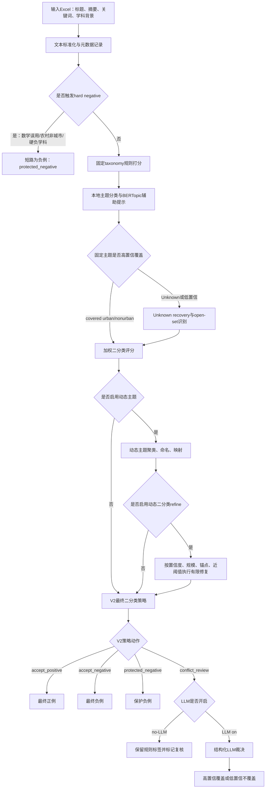

# 城市更新指标提取技术路线与架构设计说明

生成日期：2026-05-07

本文档面向技术路线图制作和方法论说明，重点不是罗列代码函数，而是把城市更新指标提取任务从输入到输出的完整架构、分支路径、算法层、规则层和执行条件讲清楚。本文档中的机器字段名保持原样，方便与预测工作簿、评估报告和代码实现互相追溯。

## 1. 总体设计目标

城市更新指标提取任务的最终目标是完成文献级二分类，判断每篇文献是否属于城市更新研究。主题发现、固定 taxonomy、动态主题和 LLM 都是服务二分类的证据层。

最终二分类输出合同：

| 字段 | 取值 | 作用 |
|---|---|---|
| `final_label` | `1` / `0` | 最终二分类标签 |
| `urban_flag` | `1` / `0` | 与 `final_label` 同步的运行标记 |
| `是否属于城市更新研究` | `1` / `0` | 中文审阅字段 |

核心设计原则：

| 原则 | 解释 |
|---|---|
| 二分类优先 | `topic_final` 是解释字段，最终结果以 `final_label` 为准 |
| 规则可解释 | 所有 no-LLM 结果必须能通过规则证据链追溯 |
| 召回优先但有保护 | 对城市更新相关研究保持较高召回，同时用 hard negative 阻断明显假阳性 |
| 动态主题旁路增强 | 动态主题不直接替代主判定，只作为证据、复核和有限修复依据 |
| LLM 困难裁决 | LLM 只处理规则无法稳定裁决的冲突样本 |
| 稳定 no-LLM 合同 | no-LLM 路径必须保持 `llm_used_sum=0` 和 `llm_attempted_sum=0` |

## 2. 输入到输出的总架构

### 2.1 输入层

输入是文献级 Excel 工作簿。每一行是一篇文献，每一列提供不同证据。

| 输入字段 | 证据类型 | 参与阶段 |
|---|---|---|
| `Article Title` | 高权重标题证据 | 全部规则、主题匹配、动态主题、LLM 裁决 |
| `Abstract` | 研究对象、方法和结果证据 | 全部规则、主题匹配、动态主题、LLM 裁决 |
| `Author Keywords` | 作者给定主题证据 | 主题匹配、动态主题、LLM 裁决 |
| `Keywords Plus` | 扩展关键词证据 | 主题匹配、动态主题 |
| `Keywords` | 关键词合并字段 | 主题匹配、动态主题 |
| `WoS Categories` | 学科背景 | hard negative、风险调整 |
| `Research Areas` | 研究领域背景 | hard negative、风险调整 |

### 2.2 输出层

输出分为四类：

| 输出类型 | 产物 | 用途 |
|---|---|---|
| 逐篇预测 | 预测工作簿 | 保存最终标签、主题、证据链、动态主题和策略动作 |
| 有标签评估 | `Eval_Summary.xlsx` | 计算 Accuracy、Precision、Recall、F1、TP、TN、FP、FN |
| 无标签诊断 | overview/report 工作簿或 CSV | 计算正例率、策略动作分布、主题分布、动态主题分布 |
| 实验归档 | `doc/experiment_archives/...` | 保存实验摘要、复现命令、技术文档和工件索引 |

### 2.3 全流程控制图



## 3. 阶段 0：文本标准化与运行上下文构建

### 3.1 输入

本阶段读取 Excel 行，并把标题、摘要、关键词、学科分类、研究领域组合成统一证据单元。

### 3.2 算法与规则

| 处理 | 说明 |
|---|---|
| 空值归一 | 将空白、缺失、非字符串值统一处理 |
| 短语标准化 | 统一大小写、连字符、空格形式，便于锚点匹配 |
| 文本拼接 | 标题、摘要、关键词、学科背景形成 `document_text` |
| 运行上下文记录 | 记录 `experiment_track`、`urban_method`、LLM 开关、动态主题开关、输出路径 |

### 3.3 输出

| 输出 | 说明 |
|---|---|
| 标准化文献记录 | 后续所有规则使用同一证据单元 |
| 运行上下文 | 控制是否启用 dynamic topics、dynamic binary refine、LLM adjudication |

## 4. 阶段 1：概念边界约束门控

学术化名称：概念边界约束门控。

本阶段先判断样本是否明显不属于城市更新研究。它位于主流程最前端，目的是减少术语误用、农村语境和纯工程方法造成的假阳性。

### 4.1 hard negative 分支

若满足以下任一条件，直接进入 hard negative 短路路径：

| 条件 | 规则表现 | 输出 |
|---|---|---|
| 数学术语误用 | `urban renewal` 与 dimer、bipartite graph、tiling、cluster algebra 等共同出现 | `metadata_route_reason=math_term_misuse` |
| 农村非城市语境 | rural regeneration、rural renewal、village revitalization、agricultural regeneration 等 | `metadata_route_reason=rural_nonurban` |
| 明显非目标学科 | mechanics、materials science、applied physics 等硬负学科与非目标关键词共同出现 | 风险或负例保护 |

执行策略：

```text
if hard_negative:
    final_label = 0
    urban_flag = 0
    是否属于城市更新研究 = 0
    taxonomy_coverage_status = hard_negative
    binary_policy_action = protected_negative
```

hard negative 的优先级最高。动态主题、召回校准和 LLM hint 都不能把 hard negative 提升为正例。

### 4.2 风险标记分支

若样本不是 hard negative，但存在风险语境，则不短路，而是把风险写入后续二分类评分。

| 风险 | 触发证据 | 后续作用 |
|---|---|---|
| `background_support_risk` | “in the context of urban renewal”等背景表达 | 降低二分类分数 |
| `social_history_media_risk` | discourse、memory、photography、cinema 等 | 降低二分类分数 |
| `greenfield_expansion_risk` | new town、greenfield、sprawl、urban expansion | 降低二分类分数 |
| `generic_technical_risk` | algorithm、deep learning、simulation、framework 等 | 降低二分类分数 |
| `explicit_renewal_wording_but_other_object` | 有 renewal 词但缺少城市更新对象 | 进入冲突或轻微调整 |

## 5. 阶段 2：固定 taxonomy 主题匹配

学术化名称：证据锚点驱动的固定主题匹配。

固定 taxonomy 提供先验主题边界。它不是最终二分类本身，但它影响二分类评分、解释、冲突判断和复核路径。

### 5.1 taxonomy 结构

固定 taxonomy 包含城市更新主题 `U1-U15`、`Urban_Renewal_Other`，以及非城市更新主题 `N1-N10`、`Nonurban_Other`。

| 主题组 | 标签 | 作用 |
|---|---|---|
| 城市更新主题 | `U1-U15`、`Urban_Renewal_Other` | 支持正例判断和主题解释 |
| 非城市更新主题 | `N1-N10`、`Nonurban_Other` | 支持负例保护和冲突识别 |
| Unknown | `Unknown` | 表示固定 taxonomy 暂不能覆盖 |

### 5.2 主题打分算法

主题匹配基于标题和摘要进行规则打分。

| 算法环节 | 说明 |
|---|---|
| seed 命中 | 统计主题种子词命中情况 |
| context 命中 | 统计主题上下文词和锚点 |
| combo rule | 判断“更新动作 + 城市对象 + 机制”组合证据 |
| exclude terms | 对排除词进行扣分或阻断 |
| top3 排序 | 输出分数最高的三个主题候选 |
| margin 判断 | 判断 top1 与 top2 差距是否足够 |

高置信条件：

| 条件 | 阈值 |
|---|---:|
| 强高置信 | `topic_rule_score >= 6.0` 且 `topic_rule_margin >= 3.0` |
| 组合规则高置信 | `topic_rule_score >= 5.0` 且存在 combo hits |
| 低置信阻断 | `topic_rule_score < 4.0` 或 `topic_rule_margin < 2.0` |

### 5.3 输出字段

| 字段 | 含义 |
|---|---|
| `topic_rule` | 规则匹配主题 |
| `topic_rule_group` | 规则主题组 |
| `topic_rule_score` | 规则主题分 |
| `topic_rule_margin` | 主题置信差距 |
| `topic_rule_top3` | 前三主题候选 |
| `topic_rule_matches` | 命中的关键词或组合证据 |
| `review_flag_rule` | 是否触发规则复核 |

## 6. 阶段 3：多源主题族融合

学术化名称：多源主题族一致性融合。

固定规则可能过窄，本地主题分类和 BERTopic 可以补充语义信息。系统用三类证据融合得到 `topic_final` 和主题族概率。

### 6.1 证据源

| 证据源 | 算法或规则 | 定位 |
|---|---|---|
| 固定规则主题 | taxonomy seed、context、combo rule | 高精度边界 |
| 本地主题分类器 | 本地主题候选评分 | 补充规则覆盖 |
| BERTopic 辅助信号 | 语义聚类主题映射 | 辅助提示，不直接覆盖最终标签 |
| LLM family hint | 只在 LLM assist 打开时采集 | Unknown 辅助提示，不替代规则 |

### 6.2 分支路径

| 分支 | 条件 | 策略 |
|---|---|---|
| 规则高置信 | 规则主题分高且 margin 足够 | 优先采用规则主题 |
| 规则与本地一致 | 主题组一致或主题相近 | 提高融合可信度 |
| 规则与本地冲突 | 一个为 urban、一个为 nonurban | 进入冲突或复核 |
| BERTopic 高质量一致 | BERTopic 主题高纯度且映射一致 | 作为增强证据 |
| BERTopic 冲突 | BERTopic 与 `topic_final` 不一致 | 标记 `bertopic_hint_conflict_flag=1` |
| 无法稳定融合 | 分数低、margin 低或证据冲突 | 输出 `topic_final=Unknown` |

### 6.3 输出

| 字段 | 含义 |
|---|---|
| `family_predicted_family` | 主题族预测 |
| `family_probability_urban` | 城市更新主题族概率 |
| `family_decision_source` | 主题族来源 |
| `topic_final` | 固定主题最终标签 |
| `topic_final_group` | `urban` / `nonurban` / `unknown` |
| `bertopic_hint_label` | BERTopic 辅助映射标签 |
| `bertopic_hint_conflict_flag` | BERTopic 是否与最终主题冲突 |

## 7. 阶段 4：Unknown recovery 与 open-set 识别

学术化名称：开放世界主题恢复。

该阶段处理固定 taxonomy 没有覆盖的样本。它的设计目的不是扩大正例，而是防止固定主题体系过窄导致漏召。

### 7.1 Unknown recovery 分支

进入条件：

```text
topic_final == Unknown
or topic_final_group == unknown
or taxonomy_coverage_status == unknown
```

恢复证据：

| 证据 | 示例 |
|---|---|
| 更新动作锚点 | renewal、regeneration、redevelopment、rehabilitation、retrofit、adaptive reuse |
| 既有城市对象 | neighborhood、old district、brownfield、housing estate、industrial heritage、public space |
| 治理机制 | compensation、relocation、land value capture、public-private partnership |
| 主题族一致 | 规则、本地主题、BERTopic 或 LLM hint 指向 urban family |

恢复失败时：

```text
topic_final = Unknown
taxonomy_coverage_status = unknown
review_flag = 1
unknown_recovery_path = retained_unknown
```

恢复成功时：

```text
topic_final = recovered_topic
taxonomy_coverage_status = binary_resolved or covered
unknown_recovery_path = rule/local/family based recovery
```

### 7.2 open-set 分支

进入条件：

- 固定 taxonomy 不能稳定映射。
- 但文献存在明确城市更新动作和既有城市对象。
- 无农村、绿地扩张、纯方法等高风险阻断。

判定逻辑：

```text
if renewal_action_anchor
   and existing_urban_object_anchor
   and title_or_policy_project_evidence
   and not high_risk:
       topic_final = Urban_Renewal_Other
       taxonomy_coverage_status = open_set
       review_flag = 1
```

输出字段：

| 字段 | 含义 |
|---|---|
| `open_set_flag` | 是否开放集 |
| `open_set_topic` | 开放集主题 |
| `open_set_reason` | 开放集原因 |
| `open_set_evidence` | 开放集证据 |

## 8. 阶段 5：加权证据二分类评分

学术化名称：加权多证据二分类评分。

本阶段把主题族、局部二分类、主题投票、锚点、风险和策略调整综合为二分类分数。

### 8.1 基础评分公式

```text
urban_probability_score =
  0.40 * family_probability_urban
+ 0.25 * topic_binary_probability
+ 0.20 * topic_vote_probability
+ 0.10 * anchor_probability
+ 0.05 * llm_hint_probability
+ risk_adjustment
+ decision_adjustment
```

默认阈值：

| 参数 | 默认值 |
|---|---:|
| `URBAN_BINARY_DECISION_THRESHOLD` | `0.45` |
| `URBAN_BINARY_LOW_CONFIDENCE_REVIEW_FLOOR` | `0.60` |

### 8.2 分量解释

| 分量 | 含义 |
|---|---|
| `family_probability_urban` | 主题族是否属于城市更新 |
| `topic_binary_probability` | 本地主题二分类概率 |
| `topic_vote_probability` | 固定主题组投票概率 |
| `anchor_probability` | 更新动作和城市对象锚点强度 |
| `llm_hint_probability` | LLM family hint，仅 LLM assist 路径可能有效 |
| `risk_adjustment` | 风险项扣分或轻微加分 |
| `decision_adjustment` | anchor guard、uncertain promotion 等策略调整 |

### 8.3 风险调整规则

| 风险 | 调整 |
|---|---:|
| `generic_technical_risk` | `-0.06` |
| `background_support_risk` | `-0.08` |
| `social_history_media_risk` | `-0.06` |
| `greenfield_expansion_risk` | `-0.12` |
| `explicit_renewal_wording_but_other_object` | `+0.03` |

### 8.4 召回校准规则

召回校准用于解决固定主题或规则过严导致的漏召。

| 触发条件 | 分数下限 |
|---|---:|
| `topic_final_group=urban` | `0.56` |
| 核心更新锚点命中 | `0.58` |
| 广义更新锚点 + 城市语境或对象 | `0.52` |
| 城市主题证据 + 对象/机制/语境 | `0.50` |
| 原始分数达到上下文相关性地板且有城市语境 | `0.46` |

阻断条件：

| 阻断 | 说明 |
|---|---|
| `generic_technical_n8_without_substantive_anchor` | N8 方法主题且缺少实体城市更新锚点 |
| `greenfield_expansion_without_renewal_anchor` | 绿地扩张但无更新动作 |

### 8.5 输出

| 字段 | 含义 |
|---|---|
| `urban_probability_score` | 二分类分数 |
| `binary_decision_threshold` | 二分类阈值 |
| `binary_decision_source` | 二分类来源 |
| `binary_decision_evidence` | 分数分量和校准证据 |
| `binary_topic_consistency_flag` | 二分类与主题组是否冲突 |
| `review_flag` | 是否需要复核 |

## 9. 阶段 6：动态主题发现

学术化名称：局部语料自适应主题发现。

动态主题层用于发现固定 taxonomy 没有覆盖的新兴主题簇。它首先是旁路证据层，只有满足严格条件时才通过动态二分类 refine 影响最终标签。

### 9.1 是否执行动态主题

执行条件：

```text
--dynamic-topics on
or --dynamic-binary-refine on
```

若未开启，直接跳过动态主题层，进入 V2 最终策略。

### 9.2 候选池构建分支

| 来源池 | 进入条件 | 作用 |
|---|---|---|
| `unknown_pool` | `topic_final=Unknown` 或 `topic_final_group=unknown` | 解释 Unknown |
| `review_pool` | `taxonomy_coverage_status` 为 unknown/open_set/binary_resolved，或 review 原因含 conflict、uncertain、near_threshold | 组织复核 |
| `nonurban_review_pool` | 当前负例但有 review/uncertain/anchor_guard 信号 | 发现漏召风险 |
| `full_corpus_pool` | `--dynamic-topics-full-corpus` 开启后剩余样本全部进入背景池 | 判断主题是否全局稳定 |

### 9.3 聚类算法

优先路径：

| 算法 | 参数 |
|---|---|
| 文本向量化 | `TfidfVectorizer` |
| n-gram | `1-2` |
| stop words | English |
| 最大特征数 | `5000` |
| 聚类 | `MiniBatchKMeans` |
| 最大主题数 | `60` |
| 最小主题规模 | `20` |
| 随机种子 | `20260427` |

降级路径：

```text
if sklearn clustering fails:
    use keyword bucket clustering
```

### 9.4 主题命名规则

主题名不调用 LLM，而是按关键词模板生成。

| 关键词 | 中文主题名 |
|---|---|
| brownfield | 棕地再开发 |
| industrial | 工业用地更新 |
| urban_village / village | 城中村改造 |
| old_community | 老旧小区改造 |
| neighborhood / neighbourhood | 社区更新 |
| heritage / historic | 历史遗产活化或历史街区更新 |
| gentrification | 绅士化与社区变化 |
| public_space / street | 公共空间或街道更新 |
| finance / governance | 更新融资、治理与政策 |

### 9.5 动态主题到固定主题映射

| `dynamic_mapping_status` | 条件 | 解释 |
|---|---|---|
| `mapped_to_fixed` | 动态关键词与固定 taxonomy 种子词重叠超过阈值 | 可映射到已有主题 |
| `candidate_new_urban_topic` | 未映射固定主题，但有城市更新动作锚点 | 疑似新城市更新主题 |
| `candidate_new_nonurban_topic` | 命中 rural、transport、algorithm、ecology、tourism 等 | 疑似非城市更新主题 |
| `needs_review` | 证据不足 | 人工复核 |

输出字段：

| 字段 | 含义 |
|---|---|
| `dynamic_topic_id` | 动态主题编号 |
| `dynamic_topic_name_zh` | 动态主题中文名 |
| `dynamic_topic_keywords` | 主题关键词 |
| `dynamic_topic_size` | 主题规模 |
| `dynamic_topic_confidence` | 动态主题置信度 |
| `dynamic_topic_source_pool` | 来源池 |
| `dynamic_to_fixed_topic_candidate` | 固定主题候选 |
| `dynamic_mapping_status` | 映射状态 |

## 10. 阶段 7：动态二分类证据修复

学术化名称：动态主题约束的召回修复。

该阶段把动态主题证据转化为有限的二分类修复。它不是无条件覆盖，而是高置信、足够规模、带锚点约束的修复机制。

### 10.1 是否执行

执行条件：

```text
--dynamic-binary-refine on
```

如果未开启，只保留动态主题解释字段，不修改最终二分类。

### 10.2 基础门槛

| 条件 | 默认阈值 |
|---|---:|
| `dynamic_binary_candidate_label` 是 `0` 或 `1` | 必须满足 |
| `dynamic_topic_confidence` | `>= 0.72` |
| `dynamic_topic_size` | `>= 20` |
| 近阈值范围 | `abs(score - threshold) <= 0.08` |

### 10.3 分支策略

| 分支 | 条件 | 策略 |
|---|---|---|
| Unknown 修复 | Unknown 或 taxonomy unknown 且动态候选为正例 | 要求核心更新锚点，无农村风险 |
| 负例转正 | 当前标签为 `0`，动态候选为 `1`，且允许 flip | 需要 review 或 near-threshold，并通过 anchor gate |
| 正例转负 | 当前标签为 `1`，动态候选为 `0` | 默认阻断，不降低召回 |
| 候选证据不足 | 置信度低、规模小或无锚点 | 不应用修复，只保留 review 证据 |

### 10.4 正例锚点门槛

Unknown 样本修复为正例必须满足：

```text
core_renewal_anchor == true
and rural_anchor == false
```

已有负例转正需要满足：

```text
(review_flag > 0 or near_threshold == true)
and common_or_core_renewal_anchor == true
and rural_anchor == false
```

### 10.5 输出

| 字段 | 含义 |
|---|---|
| `dynamic_binary_override_applied` | 是否应用修复 |
| `dynamic_binary_override_label` | 修复标签 |
| `dynamic_binary_override_topic` | 修复主题 |
| `dynamic_binary_override_reason` | 修复证据 |
| `dynamic_binary_override_source` | 修复来源 |

若应用修复，会同步更新：

- `final_label`
- `urban_flag`
- `是否属于城市更新研究`
- `topic_final`
- `topic_final_group`
- `topic_final_name`
- `taxonomy_coverage_status`
- `binary_decision_source`
- `decision_explanation`
- `binary_decision_evidence`

## 11. 阶段 8：V2 最终二分类策略

学术化名称：冲突敏感最终判定策略。

这是最终标签落点。它接收前面所有证据，并统一输出 `binary_policy_action`。

### 11.1 输入证据

| 证据 | 字段 |
|---|---|
| 当前标签 | `final_label`、`urban_flag`、`是否属于城市更新研究` |
| 固定主题 | `topic_final`、`topic_final_group` |
| 二分类分数 | `urban_probability_score`、`binary_decision_threshold` |
| 规则风险 | `metadata_route_reason`、`stage1_risk_tags` |
| 证据倾向 | `evidence_balance` |
| 动态候选 | `dynamic_binary_candidate_label` |
| 文本锚点 | 标题、摘要、关键词、学科背景 |

### 11.2 核心证据信号

强正例定义：

```text
strong_positive =
    core_renewal_anchor
    and existing_urban_object_anchor
    and not rural_risk
    and not method_only_risk
```

锚点类型：

| 类型 | 示例 |
|---|---|
| 核心更新动作 | renewal、regeneration、redevelopment、rehabilitation、retrofit、adaptive reuse、gentrification |
| 既有城市对象 | built environment、neighborhood、community、brownfield、old district、housing、public space |
| 农村风险 | rural、agricultural、village revitalization |
| 方法风险 | algorithm、model、simulation、generic technical |

### 11.3 最终动作分支

| 分支 | 条件 | 输出 |
|---|---|---|
| `protected_negative` | hard negative 或 `binary_hard_negative_override` | 最终标签 `0` |
| `accept_negative` | 当前非正例且没有强正例证据 | 最终标签 `0` |
| `accept_positive` | 城市主题正例，或冲突样本有强正例证据 | 最终标签 `1` |
| `conflict_review` | 当前正例但主题、证据或动态候选存在冲突，且无强正例闭环 | no-LLM 保留规则标签，LLM 模式进入裁决 |

### 11.4 冲突识别规则

触发任一条件即形成冲突：

| 冲突 | 条件 |
|---|---|
| `binary_topic_inconsistency` | 二分类与主题组不一致 |
| `conflict_positive` | `evidence_balance=conflict_positive` |
| `binary_positive_nonurban_topic` | 当前正例但 `topic_final_group=nonurban` |
| `binary_positive_unknown_topic` | 当前正例但 `topic_final_group=unknown` |
| 高风险非城市主题 | `topic_final in {N1,N3,N4,N5,N7,N9,N10}` |
| 方法背景风险 | method-only 或 background context |
| 近阈值 | `abs(score - threshold) <= 0.03` |
| 动态负例候选 | `dynamic_binary_candidate_label=0` |

### 11.5 no-LLM 与 LLM 分支差异

| 模式 | `conflict_review` 处理 |
|---|---|
| no-LLM | 保留当前规则标签，设置 `llm_adjudication_required=1` 但不调用 LLM，`llm_used=0`、`llm_attempted=0` |
| LLM on | 对 `llm_adjudication_required=1` 样本调用 LLM 裁决，满足置信门槛才覆盖 |

## 12. 阶段 9：LLM 困难样本裁决

学术化名称：规则约束下的困难样本语义裁决。

LLM 不参与 no-LLM 全量稳定流程。只有 research_matrix 且 `--hybrid-llm-assist on` 时才可能执行。

### 12.1 执行条件

```text
experiment_track == research_matrix
and urban_method == three_stage_hybrid
and hybrid_llm_assist == on
and llm_adjudication_required == 1
```

### 12.2 输入给 LLM 的证据

| 证据 | 字段 |
|---|---|
| 文本 | 标题、摘要、关键词 |
| 当前规则标签 | `final_label` |
| 固定主题 | `topic_final`、`topic_final_group` |
| 二分类分数 | `urban_probability_score` |
| 冲突类型 | `binary_policy_conflict_type` |
| 正负证据 | `primary_positive_evidence`、`primary_negative_evidence` |
| 动态主题 | `dynamic_topic_name_zh`、`dynamic_topic_keywords` |

### 12.3 输出约束

LLM 必须输出严格 JSON：

```json
{"label":"0 or 1","confidence":0.0,"reason":"short evidence"}
```

### 12.4 覆盖规则

| 情况 | 策略 |
|---|---|
| label 可解析且 confidence >= `0.75` | 覆盖 `final_label/urban_flag/是否属于城市更新研究`，设置 `llm_used=1` |
| label 可解析但 confidence < `0.75` | 不覆盖，仅记录 `llm_attempted=1` |
| JSON 解析失败但能提取单个 0/1 | 作为低保障 fallback，置信度默认较低 |
| 空响应或无法解析 | 不覆盖规则结果 |

## 13. 完整分支路径汇总

| 路径 | 触发条件 | 经过阶段 | 最终输出 |
|---|---|---|---|
| A hard negative 短路 | 数学误用、农村非城市、硬负学科 | 阶段 1 -> 阶段 8 | `final_label=0`、`binary_policy_action=protected_negative` |
| B 固定城市主题正例 | taxonomy 覆盖为 urban，二分类分数过阈值，无强风险 | 阶段 1-5 -> 阶段 8 | `accept_positive` |
| C 固定非城市负例 | taxonomy 为 nonurban，分数未过阈值，无强正例 | 阶段 1-5 -> 阶段 8 | `accept_negative` |
| D Unknown 本地恢复 | Unknown 但有更新动作和城市对象证据 | 阶段 4 -> 阶段 5 -> 阶段 8 | `binary_resolved` 或 `open_set` |
| E 动态主题补召 | 动态主题高置信、规模足够、正例锚点成立 | 阶段 6 -> 阶段 7 -> 阶段 8 | 修复为正例 |
| F 冲突正例 no-LLM | 当前正例但主题/证据冲突，无 LLM | 阶段 8 | 保留正例并标记 `conflict_review` |
| G 冲突正例 LLM | 当前正例冲突且 LLM 开启 | 阶段 8 -> 阶段 9 | 高置信 LLM 覆盖，否则保留规则 |
| H 动态非城市风险 | 动态主题候选为负例，但当前为正例 | 阶段 6 -> 阶段 8 | 不直接翻负，标记冲突或裁决 |

## 14. 输出校验与评估

### 14.1 预测文件校验

| 校验项 | 标准 |
|---|---|
| 行数 | 等于输入样本数 |
| 标签一致性 | `final_label`、`urban_flag`、`是否属于城市更新研究` 三列一致 |
| no-LLM 合同 | `llm_used_sum=0` 且 `llm_attempted_sum=0` |
| V2 字段 | 包含 `binary_policy_action`、`binary_policy_reason`、`binary_policy_conflict_type` |
| 动态字段 | 包含 `dynamic_topic_id`、`dynamic_mapping_status`、`dynamic_binary_candidate_label` |

### 14.2 有标签评估

| 指标 | 说明 |
|---|---|
| Accuracy | 二分类总体正确率 |
| Precision | 预测正例中真实正例比例 |
| Recall | 真实正例中被召回比例 |
| F1 | Precision 与 Recall 的调和平均 |
| TP/TN/FP/FN | 混淆矩阵 |

验收目标：

| 场景 | 目标 |
|---|---|
| 1000 篇有标签 no-LLM | Accuracy >= 80% |
| 1000 篇有标签 LLM | Accuracy >= 85% |
| 10000 篇 no-LLM 无标签 | 正例率在 75%-85% |

### 14.3 无标签结构诊断

无标签全量不能计算 Accuracy，重点看结构稳定性：

| 诊断项 | 说明 |
|---|---|
| 正例率 | 判断输出是否落入预期比例 |
| `binary_policy_action` 分布 | 判断冲突和保护负例规模 |
| `topic_final_group` 分布 | 判断固定 taxonomy 覆盖情况 |
| `dynamic_mapping_status` 分布 | 判断动态主题是否解释 Unknown |
| `evidence_balance` 分布 | 判断证据冲突规模 |
| `llm_used_sum` | 验证 no-LLM 合同 |

## 15. 当前实验结果如何支撑架构设计

| 实验 | 样本量 | LLM | 关键结果 |
|---|---:|---|---|
| 1000 有标签 no-LLM | 1000 | off | Accuracy 84.1%，达到 80% 目标 |
| 1000 有标签 LLM | 1000 | conflict only | Accuracy 90.4%，达到 85% 目标 |
| 10000 no-LLM 第一轮 | 10000 | off | 正例率 76.65% |
| 10000 no-LLM 重抽样 | 10000 | off | 正例率 75.86% |
| 40276 全量 no-LLM | 40276 | off | 正例率 76.40%，`llm_used_sum=0`，`llm_attempted_sum=0` |

全量 no-LLM 策略动作：

| 策略动作 | 数量 | 解释 |
|---|---:|---|
| `conflict_review` | 16939 | 高召回保留的冲突样本，是 LLM 或人工复核重点 |
| `accept_positive` | 13831 | 规则和主题证据一致的正例 |
| `accept_negative` | 9322 | 规则接受的负例 |
| `protected_negative` | 184 | hard negative 保护负例 |

## 16. 技术路线图绘制建议

路线图应采用“三主线 + 两反馈”的结构。

主线一：二分类主干。

```text
输入文献 -> 边界门控 -> 主题证据 -> 二分类评分 -> V2最终策略 -> 最终标签
```

主线二：动态主题证据。

```text
Unknown/review/full corpus -> TF-IDF/KMeans -> 动态主题 -> taxonomy映射 -> 动态二分类候选 -> 有限修复
```

主线三：LLM 裁决。

```text
conflict_review -> 结构化prompt -> JSON裁决 -> 高置信覆盖或保留规则
```

反馈一：人工复核到 taxonomy 扩展。

```text
candidate_new_urban_topic / needs_review -> 人工抽检 -> 新增规则锚点或扩展taxonomy
```

反馈二：评估到阈值校准。

```text
1000有标签评估 + 10000比例诊断 -> 检查FP/FN和正例率 -> 调整风险规则、锚点、阈值
```

## 17. 架构结论

该技术架构不是单一路径分类器，而是多层证据约束的二分类系统。它先用 hard negative 和概念边界控制明显假阳性，再用固定 taxonomy 提供主题解释和先验边界，随后通过加权证据评分得到基础二分类结果。对于 taxonomy 覆盖不足的样本，系统引入 open-set、Unknown recovery 和动态主题发现；对于动态主题支持的疑似漏召样本，系统通过置信度、主题规模、锚点和近阈值条件执行有限修复。最终由 V2 冲突敏感策略统一标签，并在 LLM 模式下只对困难样本进行结构化裁决。

因此，技术路线图应突出“输入证据 -> 规则边界 -> 主题解释 -> 二分类评分 -> 动态证据增强 -> 最终策略裁决 -> 可解释输出”的完整闭环。
