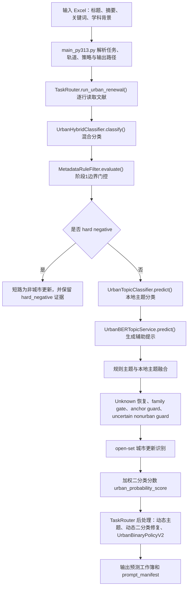

# 城市更新完整策略与代码执行流程说明

生成日期：2026-05-13

本文档说明当前项目中“城市更新”任务的完整策略与代码执行流程。文档面向代码审计、方法复现和论文方法部分改写：中文叙述为主，关键命令、字段名、方法名和代码路径保持原样，便于从文档追溯到实现和输出工作簿。

## 1. 任务目标与边界

城市更新任务的目标是对每篇文献输出稳定、可解释、可复核的二分类结果：是否属于城市更新研究。当前项目不是只判断文本中是否出现 `urban` 或 `renewal`，而是要求证据同时指向“既有城市建成环境”和“更新、再开发、再生、修复、改造、适应性再利用、绅士化、升级”等城市更新行动。

最终二分类输出以以下字段为准：

| 字段 | 取值 | 含义 |
|---|---|---|
| `final_label` | `1` / `0` | 最终二分类标签，`1` 表示城市更新研究，`0` 表示非城市更新研究 |
| `urban_flag` | `1` / `0` | 与 `final_label` 同步的运行层标签 |
| `是否属于城市更新研究` | `1` / `0` | 中文展示字段，语义上应与 `final_label` 一致 |

主题字段是解释层，不应直接等同于最终二分类标签：

| 字段 | 定位 |
|---|---|
| `topic_final` | 固定主题体系下的最终主题解释标签 |
| `topic_final_group` | 固定主题所属大类，通常为 `urban` / `nonurban` / `unknown` |
| `taxonomy_coverage_status` | 固定主题体系是否覆盖该样本 |
| `urban_probability_score` | 多证据加权得到的城市更新概率分数 |
| `binary_policy_action` | V2 最终二分类策略动作 |
| `decision_rule_stack` | 当前样本从规则、主题、家族门控到二分类策略的证据链 |

当前稳定发布主线是 `three_stage_hybrid --hybrid-llm-assist on`，入口由 `scripts/pipeline/run_stable_release.py` 固化。研究矩阵中可以比较 `pure_llm_api`、`local_topic_classifier` 和 `three_stage_hybrid`，也可以显式开启动态主题、动态二分类修复或 LLM 裁决。稳定发布结论必须遵守 README 中的稳定发布合同。

## 2. 运行入口与路径合同

权威运行入口是 `scripts/pipeline/main_py313.py`。根目录只保留 `scripts/main.py` 作为兼容入口，旧的 root-level `scripts/*.py` wrapper 已迁移到功能子包；解释当前流程时应以 `scripts/pipeline/main_py313.py` 为主。

核心入口链如下：

```text
scripts/pipeline/main_py313.py
  -> build_argument_parser()
  -> configure_task_runtime()
  -> build_execution_context()
  -> build_task_router()
  -> run_selected_task()
  -> TaskRouter.run_urban_renewal()
```

稳定发布命令：

```powershell
.venv-bertopic313\Scripts\python.exe scripts\pipeline\run_stable_release.py --skip-classification
```

通用非交互城市更新运行命令示例：

```powershell
.venv-bertopic313\Scripts\python.exe scripts\pipeline\main_py313.py `
  --non-interactive `
  --task urban_renewal `
  --experiment-track research_matrix `
  --urban-method three_stage_hybrid `
  --hybrid-llm-assist off `
  --dynamic-topics on `
  --dynamic-topics-full-corpus `
  --dynamic-binary-refine on `
  --input "Data\Urban Renovation V2.0\input\labels\Urban Renovation V2.0.xlsx"
```

`stable_release` 与 `research_matrix` 的含义不同：

| 轨道 | 用途 | 约束 |
|---|---|---|
| `stable_release` | 锁定发布级结论 | 只支持 `urban_renewal`，只支持 `three_stage_hybrid --hybrid-llm-assist on`，输入必须来自稳定发布数据集 |
| `research_matrix` | 方法比较、消融、全量分析、动态主题分析 | 可以比较不同 `urban_method`、动态主题和 LLM 选项 |
| `legacy_archive` | 历史脚本和历史结果归档 | 不应用于新的稳定结论 |

当前包内实现路径与兼容路径的关系如下：

| 当前实现路径 | 兼容路径 | 说明 |
|---|---|---|
| `src/urban/rules/metadata_filter.py` | `src/urban/urban_rule_filter.py` | 第一阶段规则与边界门控 |
| `src/urban/hybrid/classifier.py` | `src/urban/urban_hybrid_classifier.py` | 多源混合分类器主体 |
| `src/urban/hybrid/binary_policy_v2.py` | `src/urban/urban_binary_policy_v2.py` | 最终二分类策略 |
| `src/urban/topic_model/local_classifier.py` | `src/urban/urban_topic_classifier.py` | 本地主题分类 |
| `src/urban/topic_model/bertopic_service.py` | `src/urban/urban_bertopic_service.py` | BERTopic 辅助信号 |
| `src/urban/dynamic/topic_discovery.py` | `src/urban/dynamic_topic_discovery.py` | 离线动态主题发现 |

## 3. 完整执行链：输入 -> 处理 -> 输出

整体流程可以概括为：读取文献工作簿，按行构造文献记录，先做规则边界过滤，再做本地主题分类和辅助信号融合，然后进行 Unknown 恢复、家族门控、正负例保护、open-set 识别、加权二分类，最后由 V2 二分类策略统一收口并输出预测工作簿。



`TaskRouter.run_urban_renewal()` 的职责是组织运行，而不是直接做复杂判定。它负责：

| 步骤 | 代码职责 |
|---|---|
| 读取输入 | `_read_input()` 读取 Excel，`_prepare_frame_for_run()` 应用运行上下文 |
| 生成输出路径 | `_default_prediction_dir()` 与 `_build_urban_output_filename()` 确定预测文件 |
| 逐行处理 | 为每篇文献提取 `Article Title`、`Abstract` 和元数据 |
| 分派方法 | `_run_urban_method()` 根据 `urban_method` 选择 `pure_llm_api`、`local_topic_classifier` 或 `three_stage_hybrid` |
| 写 checkpoint | 运行中定期保存临时结果 |
| 后处理 | `_postprocess_urban_prediction_frame()` 执行动态主题、动态二分类修复和 V2 策略 |

`main_py313.py` 会在运行结束后写出 `<output>.prompt_manifest.json`，记录策略快照、入口、Python 版本、实验轨道、输入文件和运行上下文。这个文件是复现实验时的重要审计证据。

## 4. 三种城市更新方法

`urban_method` 决定每篇文献的主处理路径。

| 方法 | 代码入口 | 用途 | LLM 关系 |
|---|---|---|---|
| `pure_llm_api` | `TaskRouter._run_urban_pure_llm()` | 直接调用 LLM 对城市更新做二分类 | 每篇样本都尝试 LLM，`llm_used=1` |
| `local_topic_classifier` | `TaskRouter._run_urban_local_classifier()` | 只使用本地主题分类器输出主题和二分类 | 不调用 LLM |
| `three_stage_hybrid` | `UrbanHybridClassifier.classify()` | 当前主线：规则、本地主题、BERTopic 辅助、家族门控、open-set、二分类策略融合 | 只在受控条件下收集提示或裁决 |

稳定发布使用 `three_stage_hybrid`。`local_topic_classifier` 适合无 LLM 快速基线和主题体系诊断；`pure_llm_api` 适合研究矩阵中的模型对照，不是当前稳定主线。

## 5. 阶段1：概念边界与 hard negative 门控

阶段1由 `MetadataRuleFilter.evaluate(record)` 实现，当前实现位于 `src/urban/rules/metadata_filter.py`，兼容路径为 `src/urban/urban_rule_filter.py`。它的核心作用是先排除明显不属于城市更新的样本，并为后续融合提供规则主题、风险标签和审查标记。

阶段1会输出：

| 字段 | 含义 |
|---|---|
| `metadata_route` | 规则路径，如 `hard_negative` 或继续进入后续流程 |
| `metadata_route_reason` | 阶段1理由，如 `math_term_misuse`、`rural_nonurban`、`uncertain_pass` |
| `stage1_decision` | 阶段1通过或排除 |
| `stage1_reason_tag` | 可统计的阶段1原因 |
| `stage1_hit_signals` | 命中的正向或风险信号 |
| `stage1_risk_tags` | 风险标签，如方法类、绿地扩张、背景提及等 |
| `topic_rule` | 规则层推荐主题 |
| `topic_rule_score` | 规则主题得分 |
| `topic_rule_margin` | 规则主题与次优主题的差距 |
| `review_flag_rule` | 规则层是否建议复核 |

hard negative 是最强负例保护。当前明确短路的典型情况包括：

| hard negative 原因 | 含义 | 结果 |
|---|---|---|
| `math_term_misuse` | `urban renewal` 等词出现在数学、图论、材料等非城市研究语境 | 直接设为非城市更新 |
| `rural_nonurban` | 文献对象明确是乡村、村庄、农村振兴等非城市建成环境 | 直接设为非城市更新 |

如果命中 hard negative，`UrbanHybridClassifier.classify()` 会直接构造负例结果，并将 `family_decision_source` 设为 `stage1_rule`，`taxonomy_coverage_status` 设为 `hard_negative`，后续 V2 策略还会再次执行 `protected_negative` 保护。

## 6. 阶段2：本地主题分类与固定主题体系

本地主题分类由 `UrbanTopicClassifier.predict(record)` 实现，当前实现位于 `src/urban/topic_model/local_classifier.py`。它根据标题、摘要、关键词等文本证据，对固定主题体系进行打分，并输出最可能的主题、主题组、置信度、边距和二分类概率。

固定主题体系的作用不是直接替代二分类，而是提供可解释的主题证据。典型字段包括：

| 字段 | 含义 |
|---|---|
| `topic_local_label` | 本地分类器预测主题标签 |
| `topic_local_group` | 本地主题所属组 |
| `topic_local_confidence` | 本地主题置信度 |
| `topic_local_margin` | 本地主题边距 |
| `topic_local_top3` | 本地主题前三候选 |
| `topic_binary_probability` | 本地主题层面的城市更新概率 |

如果文本过短、主题得分过低、边距不足或二分类概率信号弱，本地分类器会将主题标为 `Unknown`。`Unknown` 不是最终负例，它表示固定主题体系暂时无法稳定覆盖，需要进入后续 Unknown 恢复、open-set 或人工复核路径。

## 7. 阶段3：规则主题与本地主题融合

融合逻辑在 `UrbanHybridClassifier._fuse_rule_and_local()` 中实现。它比较规则层 `topic_rule` 和本地层 `topic_local_label`，根据标签一致性、主题组一致性、规则置信度、本地置信度和边距决定候选 `topic_final`。

融合结果的典型路径包括：

| 情况 | 决策来源 | 说明 |
|---|---|---|
| 规则与本地标签一致 | `rule_model_fusion` | 直接采用一致主题 |
| 规则与本地同组但不同标签 | `stage2_classifier` 或 `rule_model_fusion` | 根据两边置信度选择更强主题 |
| 规则高置信、本地 Unknown | `rule_model_fusion` | 采用规则主题 |
| 规则 Unknown、本地已知 | `stage2_classifier` | 采用本地主题 |
| 规则与本地跨组冲突且都不够强 | `unknown_review` | 暂存为 `Unknown`，进入恢复或复核 |

这一层的目标是先形成解释性主题候选，再交给后续家族门控、保护规则、open-set 和二分类策略统一收口。

## 8. BERTopic 的角色：辅助提示与冲突诊断

BERTopic 当前由 `UrbanBERTopicService.predict(record)` 提供辅助信号，当前实现位于 `src/urban/topic_model/bertopic_service.py`。它不是最终主题判定器，也不是最终二分类判定器。

BERTopic 的输出会写入：

| 字段 | 含义 |
|---|---|
| `bertopic_status` | BERTopic 可用状态 |
| `bertopic_topic_id` | 动态主题簇编号 |
| `bertopic_mapped_label` | BERTopic 簇映射到固定主题体系后的标签 |
| `bertopic_mapped_group` | 映射主题组 |
| `bertopic_label_purity` | 簇标签纯度 |
| `bertopic_mapped_label_share` | 映射标签占比 |
| `bertopic_hint_label` | 给混合分类器使用的辅助标签 |
| `bertopic_hint_conflict_flag` | BERTopic 辅助标签与最终主题是否冲突 |
| `bertopic_primary_override` | 当前应保持为 `0`，表示 BERTopic 不作为主覆盖器 |

文档和论文叙述中应明确：BERTopic 的价值在于提供语义近邻提示、冲突诊断和 Unknown 恢复辅助。它可以参与 `family_gate` 特征、Unknown 提示和证据解释，但不会直接覆盖 `topic_final` 或 `final_label`。

## 9. Unknown 恢复、family gate 与保护规则

当规则与本地主题无法稳定给出已知主题，样本会进入 Unknown 处理链。Unknown 处理不是简单丢弃，而是依次使用离线证据、LLM 家族提示、BERTopic 辅助、家族门控和保护规则尝试恢复或标记复核。

### 9.1 Unknown 恢复

Unknown 恢复由 `UrbanHybridClassifier._resolve_unknown_with_hints()` 组织。它会优先检查离线策展规则，再检查 LLM 家族提示、BERTopic 中高质量支持、规则/本地主题家族一致性和 within-family 主题得分。

典型输出字段包括：

| 字段 | 含义 |
|---|---|
| `unknown_recovery_path` | Unknown 如何处理，如 `unknown_offline_curated_rule`、`unknown_hint_consensus`、`retained_unknown` |
| `unknown_recovery_evidence` | 恢复依据 |
| `llm_family_hint` | LLM 提供的城市更新家族提示，仅为 `0` / `1` |
| `llm_family_hint_reason` | LLM 提示的解析理由 |

如果无法可靠恢复，样本保留为 `Unknown`，并通过 `review_flag` 与 `review_reason` 标记复核。

### 9.2 family gate

`UrbanFamilyGate` 位于 `src/urban/topic_model/family_gate.py`。它的任务是判断样本更接近 `urban`、`nonurban` 还是 `unknown` 家族。输入特征包括规则家族、本地家族、BERTopic 家族、LLM 提示、风险标签、锚点命中数量、文本长度和跨组冲突等。

family gate 输出：

| 字段 | 含义 |
|---|---|
| `topic_family_rule` | 规则层家族 |
| `topic_family_local` | 本地主题家族 |
| `topic_family_final` | 最终家族 |
| `family_predicted_family` | family gate 预测家族 |
| `family_decision_source` | `family_gate_model` 或 `family_gate_heuristic` |
| `family_probability_urban` | 属于城市更新家族的概率 |
| `boundary_bucket` | 冲突边界类型 |
| `family_conflict_pattern` | 规则主题与本地主题的冲突模式 |

只有当候选主题仍为 `Unknown`、family gate 有足够置信度、within-family 主题得分和边距达到阈值，并且 LLM 提示与结构性证据一致时，family gate 才会触发 `family_gate_recovery`。

### 9.3 anchor guard

`_apply_anchor_guard()` 处理“当前主题偏非城市更新，但文本有强城市更新锚点”的样本。它会检查核心更新锚点、城市建成环境对象、family gate 概率、本地/BERTopic 城市候选和边界桶。

如果证据充分且没有风险阻断，anchor guard 可以把样本提升到城市更新主题；如果证据不足，则标记复核。它避免把含有明确城市更新行动和既有城市对象的样本错误压成负例。

### 9.4 uncertain nonurban guard

`_apply_uncertain_nonurban_guard()` 处理“规则与本地融合后给出非城市更新主题，但规则层本身低置信或有冲突”的样本。它会在高风险非城市主题、核心锚点、family gate 概率和 within-family 候选之间做二次检查。

这个保护层的作用是避免把边界样本过早定为负例。若没有可靠提升证据，则保留非城市更新并记录 `keep_0` 或复核原因。

## 10. open-set 城市更新识别

open-set 处理由 `_apply_open_set_topic()` 和 `_open_set_urban_evidence()` 实现。它解决固定主题体系覆盖不足的问题：有些文献确实属于城市更新，但不适合映射到已有 U 类主题。

open-set 正例必须有明确证据闭环，通常需要：

| 证据类型 | 示例 |
|---|---|
| 更新行动 | renewal, regeneration, redevelopment, rehabilitation, retrofit, adaptive reuse |
| 既有城市对象 | existing district, old neighborhood, brownfield, housing estate, industrial heritage, public space |
| 城市或政策语境 | urban context, project, policy, programme, intervention |

同时，open-set 会阻断高风险语境，例如纯方法、绿地扩张、乡村对象、背景性提及、社会历史媒体语境等。若通过证据检查，系统会输出 `open_set_topic`，将 `taxonomy_coverage_status` 标为 `open_set`，并把该样本纳入城市更新正例路径。

## 11. 加权二分类分数

`UrbanHybridClassifier._apply_binary_decision()` 会在主题解释之后生成二分类概率分数 `urban_probability_score`。它不是单一模型输出，而是多源证据加权：

```text
raw_score =
  0.40 * family_probability
+ 0.25 * topic_binary_probability
+ 0.20 * topic_vote_probability
+ 0.10 * anchor_probability
+ 0.05 * llm_probability
+ risk_adjustment
+ decision_adjustment
```

这些分量的含义如下：

| 分量 | 来源 | 作用 |
|---|---|---|
| `family_probability` | family gate | 判断整体更像城市更新还是非城市更新 |
| `topic_binary_probability` | 本地主题分类器 | 提供主题层面的城市更新概率 |
| `topic_vote_probability` | 规则、本地、within-family、BERTopic、final topic 投票 | 综合多个主题信号 |
| `anchor_probability` | 核心锚点与既有城市对象 | 提升明确城市更新证据 |
| `llm_probability` | LLM 家族提示 | 仅在提示存在时提供有限权重 |
| `risk_adjustment` | `stage1_risk_tags` | 对纯方法、绿地扩张、背景提及等风险降权 |
| `decision_adjustment` | 保护规则或恢复路径 | 对可信提升或弱提示进行校正 |

若命中 hard negative，系统不使用常规加权分数，而是直接写入低分并输出 `binary_hard_negative_override`。若召回校准开启，系统会基于核心锚点、城市对象、城市主题候选和上下文证据对可能漏召回的正例提高分数下限。

## 12. 动态主题发现与动态二分类修复

动态主题发现是离线后处理层，由 `DynamicTopicDiscovery` 实现，当前路径为 `src/urban/dynamic/topic_discovery.py`。它与 BERTopic 不同：动态主题发现使用本地 `TF-IDF` 向量化和 `MiniBatchKMeans` 聚类，在预测结果上追加 `dynamic_topic_*` 证据字段。

该层的设计原则是：默认只追加证据，不直接改写 `topic_final`、`urban_flag` 或 `final_label`。它主要用于：

| 用途 | 说明 |
|---|---|
| Unknown 样本诊断 | 从 Unknown 池中发现可解释的新主题簇 |
| 非城市更新复核 | 检查边界负例是否存在城市更新语义簇 |
| 全量语义结构分析 | 在全语料上观察主题分布 |
| 论文图表和附录 | 支持动态主题分布、关键词和映射状态统计 |

若开启动态二分类修复，`DynamicBinaryRefiner` 会基于动态主题证据、置信度、规模、锚点和近阈值情况进行有限修复。只有在运行上下文允许时，才会 `mutate_final_fields=True`。因此文档或报告中必须明确运行命令是否开启了 `--dynamic-binary-refine` 和 `--dynamic-binary-allow-flip`。

动态主题字段示例：

| 字段 | 含义 |
|---|---|
| `dynamic_topic_id` | 动态聚类编号 |
| `dynamic_topic_keywords` | 动态主题关键词 |
| `dynamic_topic_name_zh` | 动态主题中文命名 |
| `dynamic_mapping_status` | 动态主题是否映射到固定主题 |
| `dynamic_binary_candidate_label` | 动态二分类候选标签 |

## 13. V2 最终二分类策略

`UrbanBinaryPolicyV2.apply()` 是预测工作簿后处理的最终收口层，当前路径为 `src/urban/hybrid/binary_policy_v2.py`，兼容路径为 `src/urban/urban_binary_policy_v2.py`。它逐行读取前面所有证据，输出 `binary_policy_action` 并同步更新 `final_label`、`urban_flag` 和 `是否属于城市更新研究`。

V2 策略的主要动作：

| `binary_policy_action` | 含义 |
|---|---|
| `protected_negative` | hard negative 或强负例被保护为 `0` |
| `accept_negative` | 当前标签为负例，且无强正例支持 |
| `accept_positive` | 有足够主题、锚点或分数支持，接受正例 |
| `conflict_review` | 保留当前标签但标记冲突，必要时触发 LLM 裁决 |

V2 判断强正例时，最重要的可解释条件是：有核心更新锚点、有既有城市对象、没有乡村风险、没有纯方法或背景语境风险。V2 判断强负例时，会优先保护 `math_term_misuse`、`rural_nonurban` 等 hard negative。

V2 还会生成：

| 字段 | 含义 |
|---|---|
| `binary_policy_reason` | V2 策略理由 |
| `binary_policy_conflict_type` | 冲突类型 |
| `llm_adjudication_required` | 是否需要 LLM 裁决 |
| `llm_adjudication_label` | LLM 裁决标签 |
| `llm_adjudication_confidence` | LLM 裁决置信度 |
| `llm_adjudication_reason` | LLM 裁决理由 |

只有在 `research_matrix`、`hybrid_llm_assist_enabled=True` 且当前方法为 `three_stage_hybrid` 时，V2 层的 LLM 裁决才会启用。稳定发布路径不会把 LLM 作为任意样本的自由覆盖器。

## 14. LLM 的边界

当前代码中 LLM 可能出现在三个位置，但角色不同：

| 位置 | 触发条件 | 作用 | 是否直接替代全流程 |
|---|---|---|---|
| `pure_llm_api` | `--urban-method pure_llm_api` | 直接对每篇文献二分类 | 是研究对照路径，不是稳定主线 |
| Unknown 家族提示 | `three_stage_hybrid` 且在线提示开启，候选进入 Unknown | 只返回 `llm_family_hint`，帮助 Unknown 恢复 | 否 |
| V2 冲突裁决 | `research_matrix` 且 LLM assist 开启，V2 判断冲突需要裁决 | 对冲突样本做结构化二分类裁决 | 否 |

`llm_attempted` 与 `llm_used` 必须区分：

| 字段 | 含义 |
|---|---|
| `llm_attempted` | 是否尝试调用或解析 LLM |
| `llm_used` | LLM 结果是否实际用于覆盖最终结果 |

稳定发布合同要求 `llm_used` 保持为 `0`。研究矩阵中若启用 LLM 裁决，也必须在报告中说明触发条件、样本范围、置信度阈值和最终覆盖数量。

## 15. 正例路径与负例路径

### 15.1 正例路径

正例不是由单一关键词决定，而是由多层证据共同支持。典型正例路径如下：

```text
标题/摘要/关键词
  -> 命中城市更新行动与既有城市对象
  -> 规则主题或本地主题进入 urban 组
  -> family gate 给出较高 urban 概率
  -> open-set 或 anchor guard 处理边界样本
  -> urban_probability_score >= threshold
  -> UrbanBinaryPolicyV2 输出 accept_positive
  -> final_label = 1
```

常见正例证据包括：

| 证据 | 说明 |
|---|---|
| `core_anchor` | urban renewal, urban regeneration, redevelopment, gentrification 等核心锚点 |
| `object_anchor` | old district, existing neighborhood, brownfield, housing estate 等既有城市对象 |
| `topic_final_group=urban` | 固定主题体系判断为城市更新主题 |
| `family_probability_urban` 较高 | 家族门控认为样本属于城市更新家族 |
| `open_set_topic` | 固定主题体系未覆盖但证据闭环成立 |
| `binary_recall_calibration_flag=1` | 为避免漏召回，对有正例证据的样本提高分数下限 |

### 15.2 负例路径

负例路径使用同一个稳定术语“负例”，避免在正文中混用多个相近概念。典型负例路径如下：

```text
标题/摘要/关键词
  -> 命中 hard negative 或高风险非城市更新语境
  -> 规则主题或本地主题进入 nonurban 组
  -> 缺少更新行动与既有城市对象闭环
  -> urban_probability_score < threshold
  -> UrbanBinaryPolicyV2 输出 protected_negative 或 accept_negative
  -> final_label = 0
```

常见负例证据包括：

| 证据 | 说明 |
|---|---|
| `metadata_route_reason=math_term_misuse` | 城市更新词语被数学、材料、算法等语境误用 |
| `metadata_route_reason=rural_nonurban` | 研究对象是乡村或村庄 |
| `stage1_risk_tags` | 纯方法、绿地扩张、背景提及、社会历史媒体等风险 |
| `topic_final_group=nonurban` | 固定主题体系判断为非城市更新主题 |
| `recall_calibration=blocked` | 风险阻断后不允许召回校准提升 |
| `binary_policy_action=protected_negative` | 最终策略保护为负例 |

## 16. 输出产物与字段契约

城市更新运行主要输出预测工作簿、prompt manifest、评估报告和复核工作簿。预测工作簿是后续评估和论文统计的基础。

预测工作簿中的核心字段可分为六类：

| 类别 | 字段示例 | 作用 |
|---|---|---|
| 输入保留 | `Article Title`、`Abstract`、关键词字段 | 保留文献原始证据 |
| 最终标签 | `final_label`、`urban_flag`、`是否属于城市更新研究` | 二分类结果 |
| 主题解释 | `topic_final`、`topic_final_group`、`topic_final_name` | 固定主题解释 |
| 规则证据 | `metadata_route_reason`、`stage1_risk_tags`、`topic_rule_score` | 阶段1证据链 |
| 辅助信号 | `bertopic_hint_label`、`dynamic_topic_*`、`llm_family_hint` | 非主覆盖证据 |
| 策略审计 | `urban_probability_score`、`binary_policy_action`、`decision_explanation`、`decision_rule_stack` | 最终策略和可解释性 |

`decision_rule_stack` 是审计时最重要的压缩证据链。它把规则路径、规则主题、本地主题、family gate、anchor guard、uncertain nonurban guard、open-set、binary audit 和二分类来源串在一起，便于快速判断一行结果为什么得到当前标签。

## 17. 评估与复现

稳定发布评估必须使用 `scripts/evaluation/evaluate.py` 及其生成的 `Eval_Summary.xlsx`。README 锁定的稳定发布指标包括 Accuracy、Precision、Recall、F1、FP、FN、Predicted Unknown Count、`unknown_hint_resolution` 子集准确率、`llm_used` 等。

稳定发布复现入口：

```powershell
.venv-bertopic313\Scripts\python.exe scripts\pipeline\run_stable_release.py --skip-classification
```

如果需要重新跑分类，必须明确使用 `--force`，因为它会覆盖锁定的预测工作簿：

```powershell
.venv-bertopic313\Scripts\python.exe scripts\pipeline\run_stable_release.py --force
```

研究矩阵复现时，应在命令和报告中同时记录：

| 项目 | 说明 |
|---|---|
| `experiment_track` | 通常为 `research_matrix` |
| `dataset_id` | 数据集或实验标识 |
| `urban_method` | 三种方法之一 |
| `hybrid_llm_assist_enabled` | 是否允许 LLM 辅助 |
| `dynamic_topics_enabled` | 是否启用动态主题 |
| `dynamic_binary_refinement_enabled` | 是否启用动态二分类修复 |
| `order_id` / `order_seed` | 若有采样或排序实验，必须记录 |
| `truth_file` | 若有标签评估，必须绑定真实标签来源 |

## 18. 当前策略的论文方法写法

论文方法部分可以按以下方式概括当前方案：

> 本研究采用可解释的多层证据约束二分类流程识别城市更新文献。首先，系统从标题、摘要、关键词和学科背景构建文献级证据单元，并通过概念边界规则排除数学术语误用、乡村对象、纯方法背景和绿地扩张等负例风险。其次，系统将候选文献映射到固定城市更新主题体系，并融合本地主题分类、家族门控和 BERTopic 辅助语义提示，形成可追溯的主题解释。对于固定主题体系无法稳定覆盖的样本，系统进一步执行 Unknown 恢复、核心锚点保护和 open-set 识别，要求更新行动与既有城市建成环境对象形成证据闭环。最后，系统使用加权二分类评分和 V2 冲突敏感策略统一生成 `final_label`，同时保留 `decision_rule_stack`、`urban_probability_score` 和 `binary_policy_action` 等审计字段。LLM 只在受控研究路径中处理 Unknown 或冲突样本，不替代规则与本地模型的全量判定。

这个写法强调了三点：第一，二分类目标优先；第二，主题、动态主题和 BERTopic 是证据层；第三，LLM 是受控裁决组件，而不是全量分类器。

## 19. 验证清单

修改或复现该策略时，应检查以下项目：

| 检查项 | 期望 |
|---|---|
| 入口 | `scripts/pipeline/main_py313.py` 或 `scripts/pipeline/run_stable_release.py` |
| Python | `.venv-bertopic313`，Python 3.13 |
| 稳定发布方法 | `three_stage_hybrid --hybrid-llm-assist on` |
| 稳定发布任务 | 仅 `urban_renewal` |
| 最终标签 | `final_label`、`urban_flag`、`是否属于城市更新研究` 一致 |
| BERTopic | `bertopic_primary_override=0`，只作为辅助提示和冲突诊断 |
| 动态主题 | `dynamic_topic_*` 来自 `TF-IDF + MiniBatchKMeans` 离线后处理 |
| LLM | 稳定发布不得自由覆盖最终标签，研究矩阵需记录触发范围 |
| 输出证据 | 包含 `urban_probability_score`、`binary_policy_action`、`decision_rule_stack` |
| 评估来源 | 官方结论来自 `scripts/evaluation/evaluate.py` 与 `Eval_Summary.xlsx` |

建议的文档级检查命令：

```powershell
git diff --check
git status --short
.venv-bertopic313\Scripts\python.exe -m pytest tests\pipeline\test_stable_release_contract.py -q
```

其中 `git diff --check` 用于检查 Markdown 格式问题；`git status --short` 用于确认只新增目标文档；稳定发布合同测试用于确认 README 和稳定发布产物合同仍与代码预期一致。
