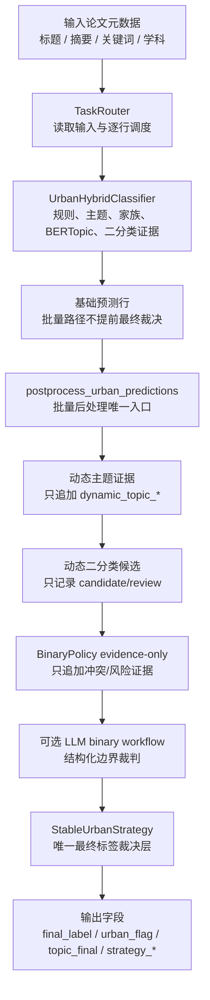

# 城市更新识别实验方案与实验设计

生成日期：2026-05-21  
适用范围：城市更新文献识别主任务、稳定发布评估、策略消融与错误诊断  
当前主线策略：stable strategy 四步判定法

## 1. 实验目标

本实验用于验证城市更新文献识别系统能否在固定标注集上稳定、可解释、可复现地完成二分类识别任务，并分析不同证据层、动态证据层和 LLM 边界裁判对结果的影响。

主任务是判断一篇论文是否属于城市更新研究。系统输入论文题名、摘要、关键词和学科元数据，输出：

- `final_label`：最终二分类标签，`1` 表示城市更新研究，`0` 表示非城市更新研究。
- `urban_flag`：与 `final_label` 同步的运行层标签。
- `topic_final`：固定主题体系下的最终主题解释标签。
- `strategy_*` 与四步证据字段：用于解释最终判断的证据、风险和冲突来源。

本实验不把“是否出现 urban / renewal 词语”作为充分条件，而是采用当前代码中的稳定定义：

> 城市更新 = 既有城市对象 + 更新/改造/再开发行动 + 该行动是文章核心主题 - 明确排除风险。

其中：

- 既有城市对象包括 old district、existing community、brownfield、historic building、public space、existing built environment 等。
- 更新行动包括 regeneration、renewal、redevelopment、rehabilitation、adaptive reuse、slum upgrading、brownfield reuse 等。
- 文章核心主题要求更新行动是论文研究对象、过程、治理或影响的主体，而不是方法、材料、污染治理或政策背景中的顺带提及。
- 明确排除风险包括 rural renewal、village revitalization、greenfield expansion、method-only/background usage、数学或算法术语误用等。

## 2. 系统策略与执行链

当前城市更新识别系统分为五层：输入与路由、单篇证据生产、批量证据增强、统一最终裁决、输出与评估。



### 2.1 单篇证据生产

`UrbanHybridClassifier` 负责为每篇论文生成基础证据，包括：

- 规则证据：更新行动词、既有城市对象词、政策项目词、风险词、hard exclusion。
- 固定主题证据：本地主题分类器给出的 `topic_local_label`、`topic_local_group`、置信度和边距。
- 家族一致性证据：城市更新、非城市更新、Unknown 家族倾向。
- BERTopic 辅助证据：聚类、语义邻近、固定主题映射和冲突提示。
- 二分类分数证据：`urban_probability_score` 和 `binary_decision_threshold`。

在批量路径中，`UrbanHybridClassifier.classify(..., finalize_strategy=False)` 只产证据，不最终写 `final_label`。最终标签由批量后处理中的 stable strategy 统一写出。

### 2.2 批量证据增强

`postprocess_urban_predictions()` 是批量后处理的唯一顺序入口。当前顺序固定为：

1. 动态主题证据：发现批量语料中的新主题簇，写入 `dynamic_topic_*`。
2. 动态二分类候选：记录可能的正负候选，写入 `dynamic_binary_candidate_*`，默认不直接改最终标签。
3. BinaryPolicy evidence-only：记录二分类和主题冲突、风险、review 需求，不直接改 `final_label`。
4. 可选 LLM binary workflow：对显式启用的二分类边界样本做结构化裁判。
5. StableUrbanStrategy：统一写最终 `topic_final`、`urban_flag`、`final_label` 和解释字段。

### 2.3 四步最终裁决

`StableUrbanDecisionEngine` 将所有证据归一为 `EvidenceBundle`，再生成 `FourStepEvidence`，最后按固定顺序裁决：

1. 硬排除：命中 math term misuse、rural nonurban 等 hard exclusion 时直接负类。
2. LLM 高置信确认：边界样本中，如果 LLM 同时确认既有城市对象、更新行动、文章主旨，并且非 background-only，则可支持正类。
3. LLM 高置信否定：如果 LLM 判断为 background-only、缺对象、缺行动或存在排除风险，则判负并标记 review。
4. 动态候选审查：动态正候选只有在规则层也具备核心对象与行动证据时才采纳，否则进入 review。
5. 背景/方法保护：method-only、background-only 样本不被模型分数单独提升为正类。
6. 规则强阳性：既有对象、更新行动、主旨三要素成立且无硬风险时判正。
7. 多源一致阳性：当前标签、主题组、家族概率、二分类分数一致支持时判正。
8. 冲突处理：二分类正但主题为非城市/Unknown、高风险主题、近阈值或证据冲突时，默认进入冲突审核或转负。
9. 默认负类：证据不足时判为非城市更新。

### 2.4 LLM 的角色

LLM 不是全量替代分类器，而是边界样本语义裁判。触发条件包括：

- 主题为 Unknown。
- 规则与主题、主题与二分类存在冲突。
- 非城市主题中出现更新行动词。
- 只有政策/治理语境但缺少明确既有城市对象。
- 风险词与更新行动混合出现，例如 method、brownfield remediation、gentrification、background-only。

LLM 输出必须是结构化语义证据，关键字段包括：

- `object_is_existing_urban`
- `renewal_action_present`
- `action_is_main_subject`
- `is_background_only`
- `exclusion_risk`
- `label_hint`
- `confidence`
- `reason`

正类使用条件为：`label_hint=1`、`confidence >= 0.75`、既有城市对象为真、更新行动为真、行动是文章主旨为真、不是 background-only，且没有排除风险。

## 3. 数据、实验组与变量控制

### 3.1 稳定评估数据

稳定评估集固定为 1000 篇人工标注样本：

```text
Data/Urban Renovation V2.0_cleaned_article_sample_1000_local_labeled_v2_20260407/input/labels/Urban Renovation V2.0_cleaned_article_sample_1000_local_labeled_v2_20260407.xlsx
```

真值字段为人工标注的城市更新二分类标签。评估时必须显式绑定 truth 文件，并启用严格匹配，避免输入与真值错位导致虚高指标。

当前稳定基线指标记录为：

| 指标 | 当前稳定线 |
|---|---:|
| Accuracy | 92.2 |
| Precision | 0.959900 |
| Recall | 0.943350 |
| F1 | 0.951553 |
| FP | 32 |
| FN | 46 |
| Predicted Unknown Count | 38 |

后续任何策略改动如果要替换稳定主线，必须至少满足 Precision 不低于当前稳定线，F1 不下降，Unknown 不恶化，并解释 FP/FN 变化。

### 3.2 主实验组

主实验比较三类方法：

| 实验组 | 方法 | 目的 |
|---|---|---|
| G1 | `local_topic_classifier` | 本地主题体系基线，不调用 LLM |
| G2 | `three_stage_hybrid --hybrid-llm-assist off` | 多证据混合但不使用 LLM 边界裁判 |
| G3 | `three_stage_hybrid --hybrid-llm-assist on` | 当前主线，验证 LLM 边界裁判收益 |

其中 G3 是稳定发布候选主线。G1 和 G2 用于证明混合策略与 LLM 边界裁判的增益。

### 3.3 消融实验组

建议加入以下消融，以定位每类证据的贡献：

| 消融组 | 关闭或改变内容 | 观察重点 |
|---|---|---|
| A1 | 关闭 LLM semantic boundary | FN 是否上升，Unknown 是否增加 |
| A2 | 关闭动态主题证据 | Unknown 恢复与主题覆盖率是否下降 |
| A3 | 关闭动态二分类候选 | 近阈值样本与疑似 FN 是否变化 |
| A4 | 关闭 binary policy evidence-only | 冲突样本 review 标记是否减少或失真 |
| A5 | 关闭 stable strategy 最终改写，仅观察 strategy_* shadow 字段 | 检查统一裁决层对主输出的影响 |

消融实验必须保持同一输入、同一 truth、同一排序、同一评估脚本，只改变目标开关。

### 3.4 控制变量

所有实验应固定：

- 数据集和 truth 文件。
- Python 环境和依赖版本。
- 输入排序，默认使用输入顺序或稳定的 canonical order。
- 输出目录结构，统一写入 `Data/<dataset_id>/runs/<track>/<tag>`。
- 评估脚本和指标定义。
- LLM 模型、温度、prompt 版本和 session policy。

如果使用在线 LLM，必须记录：

- 模型名。
- base URL 或 provider。
- prompt strategy。
- LLM 调用数、成功数、失败数、quota interruption 状态。
- checkpoint 路径和 resume 信息。

## 4. 评价指标与分析方法

### 4.1 二分类主指标

设真值为 `y_i`，预测为 `p_i`：

- `TP = count(y_i=1 and p_i=1)`
- `TN = count(y_i=0 and p_i=0)`
- `FP = count(y_i=0 and p_i=1)`
- `FN = count(y_i=1 and p_i=0)`
- `Accuracy = (TP + TN) / N`
- `Precision = TP / (TP + FP)`
- `Recall = TP / (TP + FN)`
- `F1 = 2 * Precision * Recall / (Precision + Recall)`

主表必须报告 Accuracy、Precision、Recall、F1、FP、FN、Unknown Count。

### 4.2 可解释性指标

为验证策略不是黑箱分数堆叠，需要统计：

- `strategy_status` 分布。
- `strategy_reason` 分布。
- `decision_source` 分布。
- `review_flag` 占比。
- `evidence_conflict_type` 分布。
- `core_object_evidence`、`renewal_action_evidence`、`main_subject_evidence`、`risk_evidence` 覆盖率。
- `llm_semantic_evidence` 覆盖率和 LLM 使用率。

### 4.3 错误分析

对 FP 和 FN 分别抽样分析，建议按以下桶归因：

| 错误桶 | 含义 |
|---|---|
| missing_existing_object | 缺少既有城市对象，但被判正或未召回 |
| missing_renewal_action | 缺少更新行动 |
| background_only | 更新词只是背景提及 |
| method_only | 方法、算法、模型论文误判 |
| rural_or_greenfield | 乡村更新、新城扩张或绿地开发边界 |
| brownfield_remediation_boundary | 棕地修复与再开发边界 |
| gentrification_boundary | gentrification 与更新影响研究边界 |
| topic_binary_conflict | 主题与二分类冲突 |
| llm_boundary_error | LLM 语义裁判错误或不稳定 |

每个错误桶至少记录 3-5 个代表性案例，用于论文案例分析和后续策略修复。

### 4.4 统计稳健性

建议使用 Bootstrap 95% CI：

1. 对 1000 篇样本索引做有放回重采样。
2. 每次重采样计算 Accuracy、Precision、Recall、F1。
3. 重复 `B=1000` 次。
4. 取 2.5% 和 97.5% 分位数作为置信区间。

方法间显著性比较建议使用 McNemar 检验：

- `b = count(A correct, B wrong)`
- `c = count(A wrong, B correct)`
- 使用连续性校正统计量：`chi2 = (abs(b - c) - 1)^2 / (b + c)`。

## 5. 实验流程与复现命令

### 5.1 稳定发布验证

稳定发布入口：

```powershell
.venv-bertopic313\Scripts\python.exe scripts\pipeline\run_stable_release.py
```

如果只检查已有稳定产物和合同，可使用：

```powershell
.venv-bertopic313\Scripts\python.exe scripts\pipeline\run_stable_release.py --skip-classification
```

### 5.2 研究矩阵运行

本地主题基线：

```powershell
.venv-bertopic313\Scripts\python.exe scripts\pipeline\main_py313.py `
  --non-interactive `
  --task urban_renewal `
  --experiment-track research_matrix `
  --urban-method local_topic_classifier `
  --input "Data\Urban Renovation V2.0_cleaned_article_sample_1000_local_labeled_v2_20260407\input\labels\Urban Renovation V2.0_cleaned_article_sample_1000_local_labeled_v2_20260407.xlsx"
```

混合策略但关闭 LLM：

```powershell
.venv-bertopic313\Scripts\python.exe scripts\pipeline\main_py313.py `
  --non-interactive `
  --task urban_renewal `
  --experiment-track research_matrix `
  --urban-method three_stage_hybrid `
  --hybrid-llm-assist off `
  --input "Data\Urban Renovation V2.0_cleaned_article_sample_1000_local_labeled_v2_20260407\input\labels\Urban Renovation V2.0_cleaned_article_sample_1000_local_labeled_v2_20260407.xlsx"
```

混合策略并启用 LLM 边界裁判：

```powershell
.venv-bertopic313\Scripts\python.exe scripts\pipeline\main_py313.py `
  --non-interactive `
  --task urban_renewal `
  --experiment-track research_matrix `
  --urban-method three_stage_hybrid `
  --hybrid-llm-assist on `
  --input "Data\Urban Renovation V2.0_cleaned_article_sample_1000_local_labeled_v2_20260407\input\labels\Urban Renovation V2.0_cleaned_article_sample_1000_local_labeled_v2_20260407.xlsx"
```

### 5.3 评估

统一评估入口：

```powershell
.venv-bertopic313\Scripts\python.exe scripts\evaluation\evaluate.py `
  --pred "<prediction.xlsx>" `
  --truth "Data\Urban Renovation V2.0_cleaned_article_sample_1000_local_labeled_v2_20260407\input\labels\Urban Renovation V2.0_cleaned_article_sample_1000_local_labeled_v2_20260407.xlsx" `
  --strict `
  --strict-truth-match
```

每次实验必须保留：

- 预测 workbook。
- 评估 workbook。
- prompt manifest。
- run context。
- postprocess layer 状态。
- 如果使用 LLM，保留 checkpoint/resume 摘要。

## 6. 结果表格模板

### 6.1 总体指标表

| 方法 | Accuracy | Precision | Recall | F1 | FP | FN | Unknown Count | LLM Calls |
|---|---:|---:|---:|---:|---:|---:|---:|---:|
| local_topic_classifier |  |  |  |  |  |  |  | 0 |
| three_stage_hybrid, LLM off |  |  |  |  |  |  |  | 0 |
| three_stage_hybrid, LLM on |  |  |  |  |  |  |  |  |

### 6.2 消融结果表

| 消融设置 | Precision Δ | Recall Δ | F1 Δ | FP Δ | FN Δ | Unknown Δ | 结论 |
|---|---:|---:|---:|---:|---:|---:|---|
| 关闭 LLM semantic boundary |  |  |  |  |  |  |  |
| 关闭动态主题证据 |  |  |  |  |  |  |  |
| 关闭动态二分类候选 |  |  |  |  |  |  |  |
| 关闭 binary policy evidence-only |  |  |  |  |  |  |  |

### 6.3 错误分析表

| 样本标题 | Gold | Pred | topic_final | strategy_status | 错误桶 | 主要证据 | 修复建议 |
|---|---:|---:|---|---|---|---|---|
|  |  |  |  |  |  |  |  |

### 6.4 LLM 边界样本表

| 样本标题 | LLM label | Confidence | object | action | main subject | background-only | final_label | 采纳情况 |
|---|---:|---:|---|---|---|---|---:|---|
|  |  |  |  |  |  |  |  |  |

## 7. 验收标准

稳定主线实验应满足：

- 主输出字段 `topic_final`、`urban_flag`、`final_label` 完整存在。
- `strategy_status`、`strategy_reason`、四步证据字段覆盖所有样本。
- Precision 不低于当前稳定线 `0.959900`。
- F1 不低于当前稳定线 `0.951553`。
- Unknown Count 不高于当前稳定线 `38`，除非有明确解释。
- LLM 正类采纳必须满足既有对象、更新行动、主旨三要素。
- hard exclusion 样本不能被动态主题、二分类分数或 LLM 单独提升为正类。
- 稳定发布路径失败时应 fail closed，不能静默输出缺失关键策略层的结果。

## 8. 风险与控制

### 8.1 LLM 不稳定风险

LLM 只用于边界语义裁判，不作为全量分类器。所有 LLM 参与样本必须记录结构化证据和置信度。quota 中断时使用 checkpoint/resume 机制恢复，不应重复处理已完成样本。

### 8.2 动态主题漂移风险

动态主题和动态二分类默认只追加证据，不单独决定最终标签。是否采纳必须由 stable strategy 判断。

### 8.3 主题与二分类冲突风险

`final_label=1` 但 `topic_final` 属于 `N*` 或 Unknown 的样本必须进入冲突解释，不能只用二分类分数覆盖主题风险。

### 8.4 文档与代码漂移风险

实验文档应以当前入口和当前代码合同为准：

- 主入口：`scripts/pipeline/main_py313.py`
- 稳定发布入口：`scripts/pipeline/run_stable_release.py`
- 评估入口：`scripts/evaluation/evaluate.py`
- 城市更新最终裁决：`src/urban/strategy`
- 批量后处理入口：`src/urban/pipeline/postprocess.py`

旧文档中出现的 root script 入口或历史策略名称只作为历史记录，不作为当前复现实验合同。

